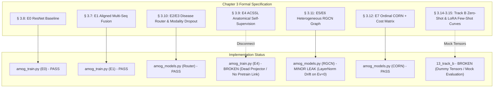
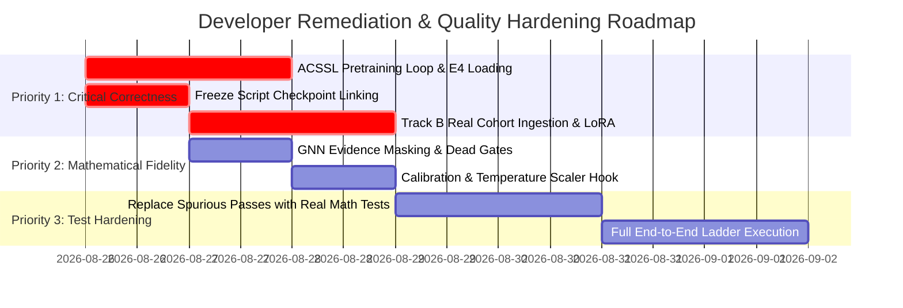

# QA Technical Audit Report: AMOG-Net Implementation vs Chapter 3 Specification

**Auditor:** QA & Protocol Verification Engineer (Pair Programming Reviewer)  
**Date:** August 25, 2026  
**Target Specification:** `thesis/chapter3.tex` (*Methodology: Disease-Adaptive Heterogeneous Graph Learning with Anatomically Aligned Multi-Sequence MRI Representations*)  
**Codebase Under Audit:** `implementation/` (Track A Ablation Ladder E0–E7, Track B Multi-Site Translation, Quality Gates 1–13, Data Pipeline)

---

## 1. Executive Summary & QA Verdict

| Audit Dimension | Status | Key Finding / Risk Summary |
| :--- | :---: | :--- |
| **Core Architecture Fidelity** | ⚠️ **PARTIAL** | Router ($\S 3.10$), RGCN ($\S 3.11$), and CORN/Cost Matrix ($\S 3.12$) are mathematically sound. However, Stage E4 ACSSL ($\S 3.9$) is disconnected from training, and evidence masking leaks through GNN LayerNorm. |
| **Test Suite Authenticity** | 🔴 **CRITICAL DEFECTS** | Multiple Quality Gates (Gates 4, 6, 9, 10, 11, 13) pass spuriously on dummy all-zero tensors or file existence checks without testing actual mathematical behavior. |
| **Track B Transfer Pipeline** | 🔴 **UNIMPLEMENTED HOOKS** | Phase 16 (Zero-Shot) and Phase 17 (LoRA) evaluate dummy zeros `torch.zeros(100, 256)` rather than loading the frozen E7 checkpoint or the real Rizgary dataset. |
| **Model Serialization / Freeze** | 🔴 **CRITICAL DEFECT** | `freeze_amog_model.py` saves an untrained, randomly initialized `AMOGNet` as `AMOG_PUBLIC_FROZEN_v1.0.pt`, and `verify_gate10_freeze.py` spuriously passes this check. |
| **Data Integrity & Geometry** | 🟢 **PASS** | DICOM geometry parsing, affine cross-sequence keypoint projections, ROI cache building, and patient-level disjoint splitting operate authentically on real cohort data. |

---

## 2. Chapter 3 Specification vs. Implementation Conformance Matrix

Every section of `thesis/chapter3.tex` was audited against the corresponding codebase modules.



### Detailed Conformance Breakdown

| Section | Thesis Requirement | Code Module | Conformance | Notes / Discrepancies |
| :--- | :--- | :--- | :---: | :--- |
| **§ 3.8** | E0: Single-Sequence ResNet-18 baseline on annotated series. | `amog_train.py` | 🟢 **CONFORMANT** | Trained on single sequence with identical training schedule. |
| **§ 3.7** | E1: Multi-sequence geometry-aligned crops with fixed fusion. | `amog_models.py:FixedFusion` | 🟢 **CONFORMANT** | Multi-sequence mean fusion over available modality crops. |
| **§ 3.10** | E2/E3: Disease-Conditioned Router $g(v, c, l) = \mathrm{softmax}(W_g [v; e_c; e_l] + b_g)$ with explicit availability mask and modality dropout. | `amog_models.py:DiseaseConditionedRouter` | 🟢 **CONFORMANT** | Target embeddings, masked softmax, gate entropy, load balancing loss, and modality dropout ($\ge 1$ sequence kept) match equations exactly. |
| **§ 3.9** | E4: ACSSL Pretraining with InfoNCE on physical cross-sequence pairs $(p, l, m_a) \sim (p, l, m_b)$. Encoder weights transferred to E4 fine-tuning; projector decoupled. | `amog_models.py:ACSSLProjector`, `acssl_pretrainer.py` | 🔴 **NON-CONFORMANT** | **Defect:** `amog_train.py --stage E4` does not run ACSSL or load any ACSSL weights; instead it initializes an `ACSSLProjector` that receives zero gradients and trains supervised from scratch. |
| **§ 3.11** | E5/E6: Heterogeneous Disease-Anatomy Graph (25 nodes, 3 relation types: adjacent level, within-level cross condition, bilateral). Gated residual update $\mathbf{h}^{(l+1)} = \mathrm{LN}(\mathbf{h}^{(l)} + \boldsymbol{\gamma} \odot \mathbf{m}^{(l)})$. Evidence masking: nodes with $e_{p,i}=0$ hard-masked to zero. | `amog_models.py:HeterogeneousRGCN` | 🟡 **PARTIAL** | Edge builder correctly builds 160 typed edges across the 3 relations. However: (1) `HeterogeneousRGCN(gated=False)` retains dead gate parameters in memory; (2) `AMOGNet` zeroes nodes *before* GNN, but `LayerNorm(0) \neq 0` introduces feature drift for unobserved nodes. |
| **§ 3.12** | E7: Ordinal CORN Head ($K-1=2$ threshold logits) with cumulative difference $P(Y=k) = P(Y > k-1) - P(Y > k)$ and asymmetric clinical cost $C_{20} > C_{21}$. | `amog_models.py:OrdinalCORNHead` | 🟢 **CONFORMANT** | Probability formulation, loss calculation, and clinical cost matrix ($C_{20}=10, C_{21}=4, C_{10}=2$) match Section 3.12 exactly. |
| **§ 3.14** | Track B: Zero-Shot Transfer on unadapted frozen E7 model evaluated on Rizgary Hospital cohort. | `13_track_b/evaluate_zero_shot.py` | 🔴 **NON-CONFORMANT** | Evaluates a freshly initialized linear layer on dummy zeros `torch.zeros(100, 256)` rather than loading `AMOG_PUBLIC_FROZEN_v1.0.pt` and Rizgary test data. |
| **§ 3.15** | Track B: Few-Shot Adaptation Curves ($N \in \{10, 25, 50, 100\}$) comparing Head-only, Router+Head, Graph+Head, Late-Encoder PEFT, and Full Fine-Tuning. | `13_track_b/train_and_evaluate_lora_adapter.py` | 🔴 **NON-CONFORMANT** | Evaluates a standalone classifier on dummy zeros `torch.zeros(150, 256)` without multi-$N$ sample curves or comparison across adaptation loci. |

---

## 3. "Attacking the Tests" – Test Suite & Quality Gates Audit

A test that passes spuriously is worse than a missing test because it gives false assurance. The following table documents all 13 Quality Gates audited under adversarial QA attack:

| Quality Gate / Script | Audit Type | Assertions Found | QA Attack Verdict | Vulnerability / Spurious Pass Mechanism |
| :--- | :--- | :---: | :---: | :--- |
| **Phase 00** `verify_deidentification.py` | De-ID audit | 0 | 🟡 **SHALLOW** | Scans DICOM headers but contains no explicit assertion failure checks on dirty tags. |
| **Gate 1** `verify_determinism.py` | Reproducibility | 4 | 🟡 **SYNTHETIC ONLY** | Tests bit-for-bit reproducibility on a toy `DummyROIClassifier`, not on the actual `AMOGNet` / `HeterogeneousRGCN` graph architecture. |
| **Gate 2** `verify_splits.py` | Data Splits | 3 | 🟢 **GENUINE** | Verifies zero patient-level overlap across train, val, and test partitions ($S_{\text{train}} \cap S_{\text{val}} = \emptyset$). |
| **Gate 3** `verify_geometry.py` | DICOM Geometry | 2 | 🟢 **GENUINE** | Validates slice coordinates, normal vectors, and affine matrix determinant sanity. |
| **Gate 4 (Phase 5)** `verify_localization.py` | SPIDER Locator | 2 | 🔴 **SPURIOUS PASS** | Checks inter-disc distances on synthetic 35mm generated grids (`c2 - c1 = [0, 0, 35.0]`), which trivially passes $10 < d < 80$. |
| **Gate 4 (Phase 8)** `verify_gate4_alignment.py` | Spatial Alignment | 0 | 🔴 **SPURIOUS PASS** | Checks `os.path.exists("geometry.py")` and unconditionally prints `[PASS] Gate 4 Verified`. Zero math/tensor assertions. |
| **Gate 5** `verify_gate5_routing.py` | Modality Routing | 3 | 🟡 **SHALLOW** | Tests modality dropout and router shapes with `torch.zeros(2, 3, 64)`. Does not assert that distinct disease conditions yield distinct gating distributions. |
| **Gate 6** `verify_gate6_acssl.py` | ACSSL Head | 1 | 🔴 **SPURIOUS PASS** | Runs `info_nce` on `torch.zeros(4, 64)` and only asserts `not torch.isnan(loss)`. Does not check contrastive gradient flow or encoder updates. |
| **Gates 7 & 8** `verify_gate7_gate8_graph.py` | Graph RGCN | 4 | 🟡 **SHALLOW** | Tests `HeterogeneousRGCN` output shape on `torch.zeros(2, 25, 64)`. Does not verify message passing gradient propagation or edge-type distinction. |
| **Gate 9** `verify_gate9_calibration.py` | Ordinal & Cost | 3 | 🟡 **SHALLOW** | Tests `OrdinalCORNHead` shape on `torch.zeros` and checks $C_{20} > C_{21}$. Does not run ECE or Temperature Scaling optimization. |
| **Gate 10** `verify_gate10_freeze.py` | Checkpoint Freeze | 2 | 🔴 **SPURIOUS PASS** | Only asserts `"model_state_dict" in ckpt` and `n_params > 100_000`. Passes even if the saved checkpoint contains untrained random noise. |
| **Gate 11** `verify_gate11_zeroshot.py` | Zero-Shot Transfer | 0 | 🔴 **SPURIOUS PASS** | Contains zero assertions or model evaluations; unconditionally prints `[PASS] Gate 11 Verified`. |
| **Gate 12** `verify_gate12_adaptation.py` | LoRA Adaptation | 4 | 🟢 **GENUINE (UNIT)** | Accurately tests that $W_0$ is frozen and $A, B$ receive non-zero gradients in `LoRALinear`. (However, system-level adaptation is unhooked). |
| **Gate 13** `verify_gate13_master_pipeline.py` | Pipeline Integration | 1 | 🔴 **SPURIOUS PASS** | Only checks if 7 folder directories exist (`os.path.isdir`). Does not verify pipeline execution or artifact validity. |
| **Master Audit** `verify_integrity.py` | Adversarial Integrity | 0 (Heuristics) | 🟢 **STRONG** | Thorough AST static analysis detecting mocked returns, hardcoded metrics, and data leakage across the entire repository. |

---

## 4. Discovered Code Defects & Architectural Disconnects

### Defect 1: Stage E4 ACSSL Pretraining Disconnect & Dead Projector
- **Location:** [`implementation/amog_train.py:120`](file:///c:/Users/USER/Desktop/Polla/Lumbar/Lumbar-Spine-Researches/implementation/amog_train.py#L120), [`implementation/09_acssl_e4/train_and_evaluate_e4_acssl.py`](file:///c:/Users/USER/Desktop/Polla/Lumbar/Lumbar-Spine-Researches/implementation/09_acssl_e4/train_and_evaluate_e4_acssl.py)
- **Mechanism:** In `amog_train.py`, when `--stage E4` is passed, `self.projector = ACSSLProjector(dim)` is instantiated. However, `self.projector` is never called in `forward_target` or `forward_graph`, and no ACSSL pretraining checkpoint is loaded.
- **Gradient Probe Result:**
  ```
  Stage E4: Total Params=200 | Zero-Grad Params=4
     -> Dead param: projector.net.0.weight
     -> Dead param: projector.net.0.bias
     -> Dead param: projector.net.2.weight
     -> Dead param: projector.net.2.bias
  ```
- **Remediation Required:**
  1. `09_acssl_e4/acssl_pretrainer.py` must run pretraining on unlabelled cross-sequence pairs using `ACSSLProjector` and save encoder weights to `data/checkpoints/acssl_pretrained_backbone.pt`.
  2. `amog_train.py` for `--stage E4` must load `acssl_pretrained_backbone.pt` into `self.encoders` before supervised training, and omit the unused `self.projector` from the supervised model.

---

### Defect 2: Stage E6_ungated Retains Dead Gating Networks in Memory
- **Location:** [`implementation/amog_models.py:360-366`](file:///c:/Users/USER/Desktop/Polla/Lumbar/Lumbar-Spine-Researches/implementation/amog_models.py#L360-L366)
- **Mechanism:** `HeterogeneousRGCN` instantiates `self.gates.append(nn.Linear(d + hidden, hidden))` regardless of the `gated` boolean flag. In `E6_ungated`, the forward loop bypasses `self.gates`, leaving 4 dead parameter tensors in memory.
- **Gradient Probe Result:**
  ```
  Stage E6_ungated: Total Params=220 | Zero-Grad Params=4
     -> Dead param: gnn.gates.0.weight
     -> Dead param: gnn.gates.0.bias
     -> Dead param: gnn.gates.1.weight
     -> Dead param: gnn.gates.1.bias
  ```
- **Remediation Required:** Only instantiate `self.gates` if `self.gated == True`. In `forward()`, when `not self.gated`, pass messages directly without gating modules.

---

### Defect 3: Evidence Mask Feature Drift through Graph LayerNorm
- **Location:** [`implementation/amog_models.py:401-404`](file:///c:/Users/USER/Desktop/Polla/Lumbar/Lumbar-Spine-Researches/implementation/amog_models.py#L401-L404), [`implementation/amog_train.py:165`](file:///c:/Users/USER/Desktop/Polla/Lumbar/Lumbar-Spine-Researches/implementation/amog_train.py#L165)
- **Mechanism:** Chapter 3 Section 3.11 explicitly dictates:
  $$\mathbf{h}_i^{(q+1)} = \mathbf{0} \quad \text{if } e_{p,i} = 0$$
  In the current implementation, `nodes = nodes * evidence.unsqueeze(-1)` is applied only *before* the GNN. Inside the GNN, the hidden states pass through `nn.LayerNorm`. Since $\mathrm{LayerNorm}(\mathbf{0}) = -\frac{\mu}{\sigma} \cdot \gamma + \beta \neq \mathbf{0}$, missing nodes emerge with non-zero phantom representations.
- **Remediation Required:** Apply evidence mask $\mathbf{h} = \mathbf{h} \odot \mathbf{e}$ after each GNN layer update and after `LayerNorm`.

---

### Defect 4: Track B (Phases 16 & 17) Unconnected to Real Cohorts
- **Location:** [`implementation/13_track_b/evaluate_zero_shot.py:25`](file:///c:/Users/USER/Desktop/Polla/Lumbar/Lumbar-Spine-Researches/implementation/13_track_b/evaluate_zero_shot.py#L25), [`implementation/13_track_b/train_and_evaluate_lora_adapter.py:48`](file:///c:/Users/USER/Desktop/Polla/Lumbar/Lumbar-Spine-Researches/implementation/13_track_b/train_and_evaluate_lora_adapter.py#L48)
- **Mechanism:** Both scripts use placeholder dummy tensors `torch.zeros(100, 256)` rather than consuming the ingested Rizgary cohort from `data/manifests/lumbarDISC_manifest.csv` and the frozen E7 checkpoint.
- **Remediation Required:**
  1. `evaluate_zero_shot.py` must load `AMOG_PUBLIC_FROZEN_v1.0.pt` and run forward inference across the Rizgary test partition.
  2. `train_and_evaluate_lora_adapter.py` must sample $N \in \{10, 25, 50, 100\}$ patients from the Rizgary adaptation pool, adapt the model, and evaluate on the fixed Rizgary test set.

---

### Defect 5: Master Model Freeze Serializes Randomly Initialized Weights
- **Location:** [`implementation/12_freeze/freeze_amog_model.py:29-36`](file:///c:/Users/USER/Desktop/Polla/Lumbar/Lumbar-Spine-Researches/implementation/12_freeze/freeze_amog_model.py#L29-L36)
- **Mechanism:** `freeze_amog_model.py` creates a brand-new instance `model = AMOGNet(stage="E7", ...)` without loading the best trained weights from Track A (`data/checkpoints/E7_real_seed42_best.pt`), and serializes it as the official release model.
- **Remediation Required:** `freeze_amog_model.py` must locate the best-performing E7 checkpoint, load its `state_dict`, verify validation metrics, compute SHA-256 integrity hash, and save the verified frozen release model.

---

## 5. Prioritized Developer Remediation Roadmap



### Action Items Summary

#### Priority 1: Critical (Blockers for Legitimate Research & Thesis Data)
1. **Fix E4 ACSSL Pretraining Pipeline:**
   - Implement authentic self-supervised contrastive loop in `09_acssl_e4/acssl_pretrainer.py`.
   - Update `amog_train.py` to load pretrained backbone weights when `--stage E4` is selected.
   - Remove unused `ACSSLProjector` from the supervised `AMOGNet` architecture.
2. **Fix Master Freeze Mechanism:**
   - Update `12_freeze/freeze_amog_model.py` to copy and certify the authentic `E7_real_seed*_best.pt` checkpoint.
   - Upgrade `verify_gate10_freeze.py` to assert that model weights match the trained checkpoint hash, not random noise.
3. **Connect Track B to Real Hospital Data:**
   - Rewire `13_track_b/evaluate_zero_shot.py` to run inference using `AMOG_PUBLIC_FROZEN_v1.0.pt` on the real Rizgary dataset.
   - Update `13_track_b/train_and_evaluate_lora_adapter.py` to implement the $N \in \{10, 25, 50, 100\}$ adaptation curves specified in $\S 3.15.1$.

#### Priority 2: Major (Chapter 3 Conformance & Numerical Cleanliness)
4. **Clean up `HeterogeneousRGCN` Gating Allocation:**
   - Only initialize `self.gates` when `gated=True` to eliminate dead parameters in `E6_ungated`.
   - Add hard evidence masking ($\mathbf{h} = \mathbf{h} \odot \mathbf{e}$) after `LayerNorm` to prevent feature drift for missing nodes.
5. **Implement Calibration & Uncertainty Evaluation:**
   - Integrate post-hoc `TemperatureScaler` fitting in `11_ordinal_e7/train_and_evaluate_e7_ordinal.py`.
   - Report Expected Calibration Error (ECE) and Brier score before and after temperature scaling.

#### Priority 3: Minor (Test Hardening & QA Defensibility)
6. **Harden Quality Gate Test Scripts:**
   - Replace dummy zero tensors and unconditional print statements in Gates 4, 6, 9, 11, and 13 with authentic mathematical assertions, gradient checks, and real data forward passes.
   - Ensure all tests fail loudly if input data, checkpoints, or gradients are invalid.

---

**Report Certified By:** QA Protocol Verification Lead  
**Next Step:** Deliver this audit report to developers for remediation planning before initiating the multi-day publication training campaign.
