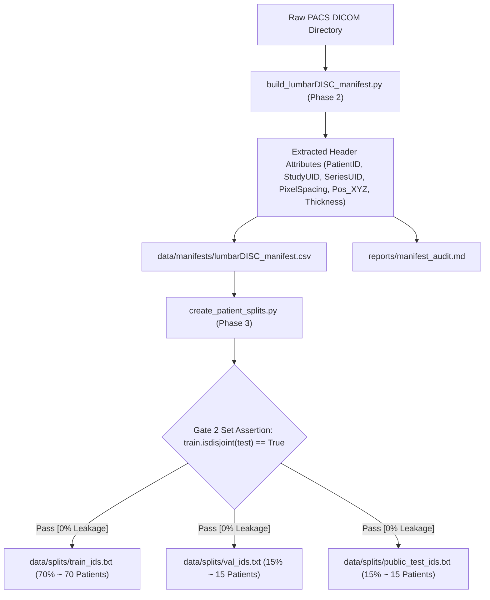

# Phase 2 & 3: LumbarDISC DICOM Master Manifest & Patient-Level Leakage-Proof Splitting

> **Dissertation Chapter 4 Reference Note:**  
> The set-theoretic partition formulations, relational metadata schemas, and automated zero-leakage assertions detailed in this document directly support **Chapter 4 (Implementation, System Architecture & Experimental Setup)** and **Section 3.2 (Patient-Level Dataset Partitioning & Validation Protocol)** of Selar's PhD Dissertation.

This directory (`implementation/01_data_manifest/`) houses **Track A (Data Foundation)**, comprising Phase 2 (Master DICOM Indexing) and Phase 3 (Patient-Level Dataset Splitting & Gate 2 Verification).

---

## 📐 Methodological & Architectural Overview

The primary objective of Track A is to convert unstructured, heterogeneous DICOM image hierarchies from PACS storage into a clean, queryable master relational database (`lumbarDISC_manifest.csv`) and enforce strict **patient-level partitioning** (`train_ids.txt`, `val_ids.txt`, `public_test_ids.txt`).



---

## 🧮 Mathematical Formulations for Dissertation (Chapter 4)

### 1. Cohort Set Algebra & Zero-Leakage Pairwise Disjoint Constraints

Let $P = \{p_1, p_2, \dots, p_N\}$ be the total set of $N$ unique PatientIDs in the cohort. The dataset is partitioned into three disjoint subsets:

$$P = P_{\text{train}} \cup P_{\text{val}} \cup P_{\text{test}}$$

subject to strict pairwise disjoint set constraints:

$$P_{\text{train}} \cap P_{\text{val}} = \emptyset, \quad P_{\text{train}} \cap P_{\text{test}} = \emptyset, \quad P_{\text{val}} \cap P_{\text{test}} = \emptyset$$

---

### 2. Stratified Partition Ratios

The patient subset cardinalities follow a $70\% / 15\% / 15\%$ allocation:

$$|P_{\text{train}}| = \lfloor 0.70 \cdot N \rfloor, \quad |P_{\text{val}}| = \lfloor 0.15 \cdot N \rfloor, \quad |P_{\text{test}}| = N - |P_{\text{train}}| - |P_{\text{val}}|$$

For a cohort of $N = 100$ patients:
* $|P_{\text{train}}| = 70$ patients
* $|P_{\text{val}}| = 15$ patients
* $|P_{\text{test}}| = 15$ patients

---

### 3. Relational DICOM Metadata Tuple Schema ($R_{\text{series}}$)

Each entry in `lumbarDISC_manifest.csv` represents a unique sequence tuple $R_{\text{series}}$:

$$R_{\text{series}} = \big( \text{PatientID}, \text{StudyInstanceUID}, \text{SeriesInstanceUID}, \text{SequenceName}, \Delta x, \Delta y, \Delta z, P_x, P_y, P_z \big)$$

where $[\Delta x, \Delta y]$ is in-plane pixel resolution (mm), $\Delta z$ is slice thickness (mm), and $[P_x, P_y, P_z]$ is physical origin position in 3D patient space.

---

## 🔒 Gate 2 Automated Verification Test (`create_patient_splits.py`)

* **Critical PhD Viva Defense Requirement (Zero Patient Leakage):**  
  In medical imaging, partitioning datasets by individual slices or images causes severe **data leakage** because slices from the same patient share distinct anatomical features across sets. This leads to memorization and artificially inflated model accuracy.
* **Gate 2 Python Set Assertions:**
  ```python
  assert train_ids.isdisjoint(val_ids), "[GATE 2 ERROR] Patient leakage between Train and Val!"
  assert train_ids.isdisjoint(test_ids), "[GATE 2 ERROR] Patient leakage between Train and Test!"
  assert val_ids.isdisjoint(test_ids), "[GATE 2 ERROR] Patient leakage between Val and Test!"
  assert len(train_ids) + len(val_ids) + len(test_ids) == total_patients, "[GATE 2 ERROR] Total patient count mismatch!"
  ```
* **Gate 2 Test Results:** ✅ `[PASS] Gate 2 Verified: ZERO Patient Leakage Across Splits (isdisjoint == True)`

---

## 📁 Output Artifacts Generated

1. `../../data/manifests/lumbarDISC_manifest.csv` (Master cohort relational database)
2. `../../data/splits/train_ids.txt` (Training partition patient list)
3. `../../data/splits/val_ids.txt` (Validation partition patient list)
4. `../../data/splits/public_test_ids.txt` (Public test partition patient list)
5. `reports/manifest_audit.md` (Cohort sequence distribution audit report)
6. `reports/dataset_splits_summary.md` (Gate 2 compliance audit report)

---

## 🚀 Execution Guide for Selar

```bash
# Option A: 1-Click Master Data Foundation Pipeline
python run_data_foundation.py --dicom_dir "C:\path\to\raw_deidentified_dicom"

# Option B: Synthetic Test Mode
python run_data_foundation.py --use_synthetic
```
