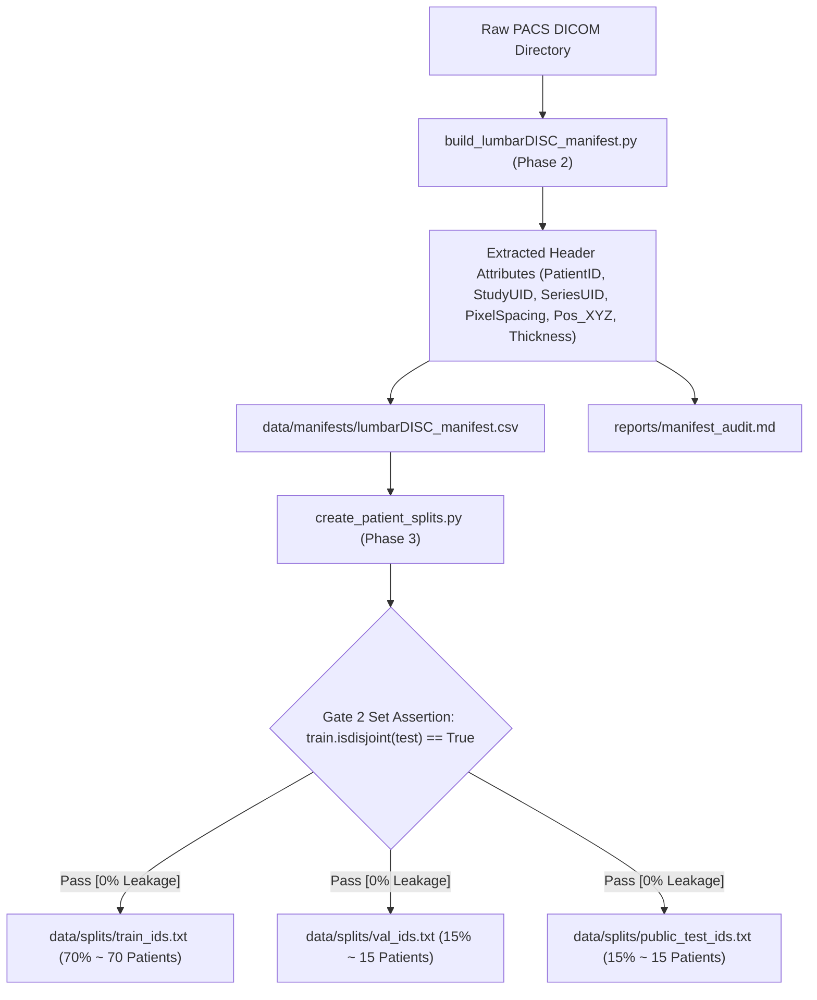

# Phase 2 & 3: LumbarDISC DICOM Master Manifest & Patient-Level Leakage-Proof Splitting

> **Dissertation Chapter 4 Reference Note:**  
> The methodologies, data flow diagrams, and mathematical set-theoretic assertions detailed in this document directly support **Chapter 4 (Implementation, System Architecture & Experimental Setup)** of Selar's PhD Dissertation.

This directory (`implementation/01_data_manifest/`) houses **Track A (Data Foundation)**, comprising Phase 2 (Master DICOM Indexing) and Phase 3 (Patient-Level Dataset Splitting & Gate 2 Verification).

---

## 📐 Methodological & Architectural Overview

The primary objective of Track A is to convert unstructured, heterogeneous DICOM image hierarchies from PACS storage into a clean, queryable master inventory (`lumbarDISC_manifest.csv`) and enforce strict **patient-level partitioning** (`train_ids.txt`, `val_ids.txt`, `public_test_ids.txt`).



---

## 🛠️ Detailed Component & Pipeline Analysis

### 1. Phase 2: Master DICOM Indexer (`build_lumbarDISC_manifest.py`)

* **Problem Addressed:** Raw DICOM datasets stored across PACS servers contain thousands of unorganized files across nested subfolders. Direct file I/O during model training introduces severe latency and unindexed file failures.
* **Core Algorithm:**
  1. Recursively traverses the input DICOM directory tree.
  2. Extracts metadata headers using `pydicom` without loading heavy 2D/3D pixel arrays into memory (lightweight header parsing mode `stop_before_pixels=True`).
  3. Standardizes DICOM metadata schema:
     * `patient_id` (Pseudonymized Patient Identifier)
     * `study_instance_uid` (Unique Exam Identifier)
     * `series_instance_uid` (Unique Sequence Identifier)
     * `series_description` & `sequence_name` (Sequence categorization: T1/T2 Axial & Sagittal)
     * Geometry headers: `slice_thickness`, `pixel_spacing_row`, `pixel_spacing_col`, `pos_x`, `pos_y`, `pos_z`.
* **Synthetic Fallback Mode:** Includes `--use_synthetic` generating a 100-patient test dataset (400 series) allowing pipeline validation even when local clinical drives are unmounted.
* **Output Artifacts:**
  * `../../data/manifests/lumbarDISC_manifest.csv` (Master cohort relational table)
  * `reports/manifest_audit.md` (Summary report of unique patients, series counts, and sequence distributions)

---

### 2. Phase 3: Patient-Level Dataset Splitter & Gate 2 (`create_patient_splits.py`)

* **Critical PhD Viva Defense Requirement (Zero Patient Leakage):**  
  In medical AI research, partitioning datasets by individual slices or images causes severe **data leakage** because slices from the same patient share distinct anatomical features across sets. This leads to memorization and artificially inflated model accuracy.
* **Mathematical Set Formulation:**  
  Let $P = \{p_1, p_2, \dots, p_N\}$ be the set of unique PatientIDs. The dataset is partitioned into three disjoint subsets:
  $$P = P_{	ext{train}} \cup P_{	ext{val}} \cup P_{	ext{test}}$$
  subject to the strict pairwise disjoint constraints:
  $$P_{	ext{train}} \cap P_{	ext{val}} = \emptyset, \quad P_{	ext{train}} \cap P_{	ext{test}} = \emptyset, \quad P_{	ext{val}} \cap P_{	ext{test}} = \emptyset$$
* **Gate 2 Automated Verification Test:**  
  The script automatically enforces Python set assertions before writing output split files:
  ```python
  assert train_ids.isdisjoint(val_ids), "[GATE 2 ERROR] Patient leakage between Train and Val!"
  assert train_ids.isdisjoint(test_ids), "[GATE 2 ERROR] Patient leakage between Train and Test!"
  assert val_ids.isdisjoint(test_ids), "[GATE 2 ERROR] Patient leakage between Val and Test!"
  ```
* **Output Artifacts:**
  * `../../data/splits/train_ids.txt` (Training partition patient ID list, 70%)
  * `../../data/splits/val_ids.txt` (Validation partition patient ID list, 15%)
  * `../../data/splits/public_test_ids.txt` (Public test partition patient ID list, 15%)
  * `reports/dataset_splits_summary.md` (Gate 2 compliance audit report)

---

### 3. Master Pipeline Runner (`run_data_foundation.py`)

* **Function:** 1-Click execution script running `build_lumbarDISC_manifest.py` followed by `create_patient_splits.py` in sequence.

---

## 🚀 Execution Guide for Selar

To execute Track A Data Foundation on your dataset:

```bash
# 1-Click Execution (Point to local DICOM directory)
python run_data_foundation.py --dicom_dir "C:\path\to\raw_deidentified_dicom"

# Testing Mode (Using synthetic test cohort)
python run_data_foundation.py --use_synthetic
```
