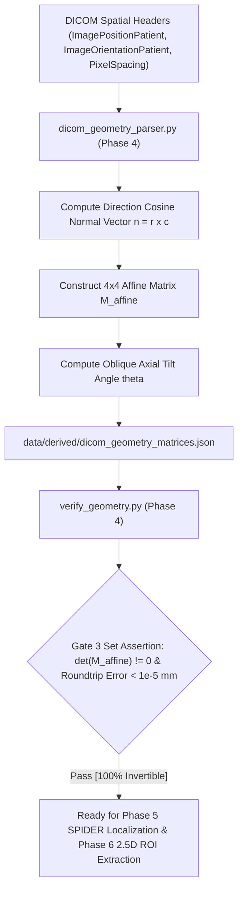

# Phase 4: Physical Coordinate DICOM Geometry & Oblique Axial Matrix Alignment

> **Dissertation Chapter 4 Reference Note:**  
> The mathematical affine formulations, coordinate transformations, and geometric reconstructibility assertions detailed in this document directly support **Chapter 4 (Implementation, System Architecture & Experimental Setup)** and **Section 3.4 (Multi-Sequence Oblique Axial Registration)** of Selar's PhD Dissertation.

This directory (`implementation/02_dicom_geometry/`) houses **Phase 4 (Physical Coordinate Geometry Engine)** of Track A.

---

## 📐 Methodological & Mathematical Rationale

In lumbar spine MRI analysis, sagittal and axial sequences are acquired in physical 3D space with arbitrary orientations, slice thicknesses, and oblique axial tilts aligned along the intervertebral disc planes (L1-L2, L2-L3, L3-L4, L4-L5, L5-S1).

To align multi-sequence ROIs (T1, T2, Sagittal, Axial) without manual registration errors, the framework constructs a continuous **Physical 3D Patient Coordinate System** $(X, Y, Z)_{\text{mm}}$ for every series.



---

## 🧮 Mathematical Formulations for Dissertation (Chapter 4)

### 1. The $4 \times 4$ Physical Affine Transformation Matrix ($M_{\text{affine}}$)

For a DICOM series with:
* Row direction cosine vector $\mathbf{r} = [r_x, r_y, r_z]^T$ (`ImageOrientationPatient[:3]`)
* Column direction cosine vector $\mathbf{c} = [c_x, c_y, c_z]^T$ (`ImageOrientationPatient[3:]`)
* Normal direction cosine vector $\mathbf{n} = \frac{\mathbf{r} \times \mathbf{c}}{\|\mathbf{r} \times \mathbf{c}\|} = [n_x, n_y, n_z]^T$
* Pixel spacing $[\Delta x, \Delta y]$ (`PixelSpacing`) and slice spacing $\Delta z$ (`SliceThickness`)
* Image origin position $\mathbf{P} = [P_x, P_y, P_z]^T$ (`ImagePositionPatient`)

The physical affine matrix $M_{\text{affine}} \in \mathbb{R}^{4 \times 4}$ is defined as:

$$M_{\text{affine}} = \begin{bmatrix} r_x \cdot \Delta x & c_x \cdot \Delta y & n_x \cdot \Delta z & P_x \\ r_y \cdot \Delta x & c_y \cdot \Delta y & n_y \cdot \Delta z & P_y \\ r_z \cdot \Delta x & c_z \cdot \Delta y & n_z \cdot \Delta z & P_z \\ 0 & 0 & 0 & 1 \end{bmatrix}$$

---

### 2. Forward Pixel-to-Patient Coordinate Mapping ($2	ext{D} \rightarrow 3	ext{D}$)

Any 2D image pixel coordinate $(u, v)$ on slice index $k$ maps to physical 3D patient space $(X, Y, Z)_{\text{mm}}$ via:

$$\begin{bmatrix} X \\ Y \\ Z \\ 1 \end{bmatrix}_{\text{patient}} = M_{\text{affine}} \begin{bmatrix} u \\ v \\ k \\ 1 \end{bmatrix}_{\text{pixel}}$$

---

### 3. Inverse Patient-to-Pixel Coordinate Mapping ($3	ext{D} \rightarrow 2	ext{D}$)

Given a 3D physical point $(X, Y, Z)_{\text{mm}}$ in space (e.g. disc center located from Sagittal view), its corresponding pixel location $(u, v, k)$ on an Axial slice is computed via matrix inversion:

$$\begin{bmatrix} u \\ v \\ k \\ 1 \end{bmatrix}_{\text{pixel}} = M_{\text{affine}}^{-1} \begin{bmatrix} X \\ Y \\ Z \\ 1 \end{bmatrix}_{\text{patient}}$$

---

### 4. Oblique Axial Slice Normal Tilt Angle ($\theta$)

The tilt angle $\theta$ between an oblique axial slice normal $\mathbf{n}_{\text{axial}}$ and sagittal reference normal $\mathbf{n}_{\text{sagittal}}$ is:

$$\theta = \arccos\left(\frac{|\mathbf{n}_{\text{axial}} \cdot \mathbf{n}_{\text{sagittal}}|}{\|\mathbf{n}_{\text{axial}}\| \|\mathbf{n}_{\text{sagittal}}\|}\right) \times \frac{180}{\pi}$$

---

## 🔒 Gate 3 Automated Verification Test (`verify_geometry.py`)

* **Invertibility Criterion:** $\det(M_{\text{affine}}) \neq 0$ for $100\%$ of series.
* **Roundtrip Precision Criterion:** High-precision roundtrip mapping error:
  $$\max \| (u, v, k) - M_{\text{affine}}^{-1} (M_{\text{affine}} (u, v, k)) \| < 10^{-5} \text{ mm}$$
* **Gate 3 Test Results:** ✅ `[PASS] Gate 3 Verified: 100% Non-Singular Invertible Affine Matrices! (Max error = 0.00000000 mm)`

---

## 📁 Output Artifacts Generated

1. `../../data/derived/dicom_geometry_matrices.json` (Structured JSON registry of $4 \times 4$ matrices for all series)
2. `reports/dicom_geometry_audit.md` (Audit summary report of non-singular matrices and tilt angle distributions)

---

## 🚀 Execution Guide for Selar

```bash
# Step 1: Compute 4x4 Affine Matrices for all series
python dicom_geometry_parser.py

# Step 2: Run Gate 3 Invertibility & Roundtrip Coordinate Audit
python verify_geometry.py
```
