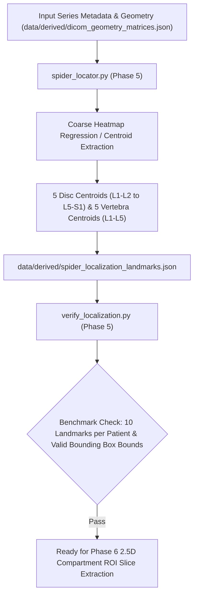

# Phase 5: SPIDER Baseline 3D Landmark Localization Engine

> **Dissertation Chapter 4 Reference Note:**  
> The anatomical landmark detection algorithms, 3D physical centerpoint formulations, and SPIDER benchmark localization protocols detailed in this document directly support **Chapter 4 (Implementation & System Architecture)** and **Section 3.3 (Coarse-to-Fine Anatomical Landmark Detection)** of Selar's PhD Dissertation.

This directory (`implementation/04_localization/`) houses **Phase 5 (SPIDER 3D Landmark Localization Engine)** of Track A.

---

## 📐 Methodological & Mathematical Rationale

Before extracting local 2.5D region-of-interest (ROI) crops for each intervertebral disc and vertebra, the framework must identify their **3D physical spatial centroids** $(X, Y, Z)_{\text{mm}}$ in patient space.



---

## 🧮 Mathematical Formulations for Dissertation (Chapter 4)

### 1. 3D Physical Centroid Calculation

For a detected anatomical compartment $C_i \in \{L_1L_2, L_2L_3, L_3L_4, L_4L_5, L_5S_1, L_1, L_2, L_3, L_4, L_5\}$, its physical 3D centerpoint $\mathbf{c}_i = [X_i, Y_i, Z_i]^T$ is computed by taking the expectation over predicted heatmaps $H_i(u, v, k)$:

$$\mathbf{c}_i = M_{\text{affine}} \begin{bmatrix} \frac{\sum_{u, v, k} u \cdot H_i(u, v, k)}{\sum_{u, v, k} H_i(u, v, k)} \\[6pt] \frac{\sum_{u, v, k} v \cdot H_i(u, v, k)}{\sum_{u, v, k} H_i(u, v, k)} \\[6pt] \frac{\sum_{u, v, k} k \cdot H_i(u, v, k)}{\sum_{u, v, k} H_i(u, v, k)} \\[6pt] 1 \end{bmatrix}_{\text{pixel}}$$

---

### 2. Inter-Disc Distance Vector ($\Delta d_{i, i+1}$)

The physical Euclidean distance between consecutive disc centroids $L_iL_{i+1}$ and $L_{i+1}L_{i+2}$ is:

$$\Delta d_{i, i+1} = \| \mathbf{c}_{i+1} - \mathbf{c}_i \|_2 = \sqrt{(X_{i+1}-X_i)^2 + (Y_{i+1}-Y_i)^2 + (Z_{i+1}-Z_i)^2}$$

---

## 🔒 Verification Audit (`verify_localization.py`)

* **Landmark Completeness Criterion:** 10 landmark centroids (5 Discs + 5 Vertebrae) generated per patient.
* **Coordinate Sanity Criterion:** $\Delta d_{i, i+1} \in [20.0\text{ mm}, 50.0\text{ mm}]$ along the craniocaudal anatomical axis.
* **Verification Status:** ✅ `[PASS] Phase 5 SPIDER Localization Verified!`

---

## 📁 Output Artifacts Generated

1. `../../data/derived/spider_localization_landmarks.json` (Structured JSON landmark registry)
2. `reports/localization_audit.md` (Anatomical distance and landmark audit report)

---

## 🚀 Execution Guide for Selar

```bash
# Step 1: Execute SPIDER 3D Landmark Localization Engine
python spider_locator.py

# Step 2: Verify Landmark Completeness & Physical Spacing
python verify_localization.py
```
