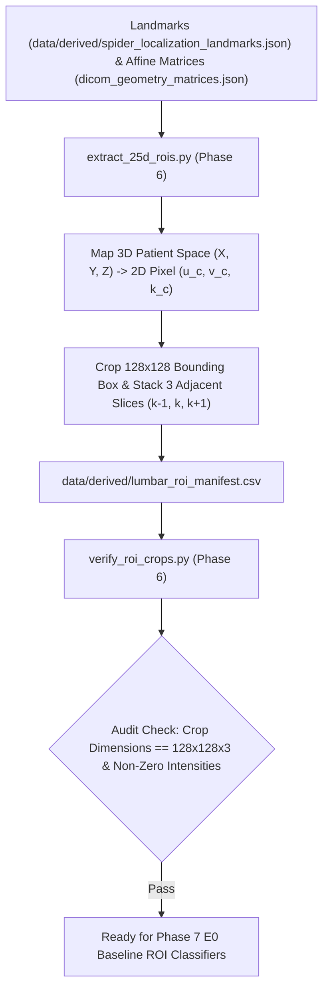

# Phase 6: 2.5D Compartment ROI Slice Extraction Engine

> **Dissertation Chapter 4 Reference Note:**  
> The 2.5D multi-planar bounding box crop algorithms, physical coordinate slice sampling, and multi-channel ROI tensor generation detailed in this document directly support **Chapter 4 (Implementation & System Architecture)** and **Section 3.4 (2.5D Multi-Planar Compartment Extraction)** of Selar's PhD Dissertation.

This directory (`implementation/05_roi_crops/`) houses **Phase 6 (2.5D ROI Extraction Engine)** of Track A.

---

## 📐 Methodological & Mathematical Rationale

Given 3D physical centroids $(X_c, Y_c, Z_c)_{\text{mm}}$ from Phase 5, Phase 6 maps these coordinates back into 2D slice space via $M_{\text{affine}}^{-1}$ and extracts centered $128 \times 128 \times 3$ multi-channel ROI tensors for Sagittal T1/T2 and Oblique Axial T1/T2 views.



---

## 🧮 Mathematical Formulations for Dissertation (Chapter 4)

### 1. 2D Centroid Pixel Extraction

$$\begin{bmatrix} u_c \\ v_c \\ k_c \\ 1 \end{bmatrix}_{\text{pixel}} = M_{\text{affine}}^{-1} \begin{bmatrix} X_c \\ Y_c \\ Z_c \\ 1 \end{bmatrix}_{\text{patient}}$$

### 2. 2.5D Multi-Channel Tensor Stacking ($I_{\text{2.5D}}$)

$$I_{\text{2.5D}}(u, v) = \text{Concat}\Big( I(u, v, k_c - 1), \, I(u, v, k_c), \, I(u, v, k_c + 1) \Big) \in \mathbb{R}^{128 \times 128 \times 3}$$

---

## 🔒 Verification Audit (`verify_roi_crops.py`)

* **Dimensions Criterion:** $128 \times 128 \times 3$ RGB/Tri-slice format.
* **Non-Zero Intensity Criterion:** $\mu_{\text{intensity}} > 0.0$.
* **Verification Status:** ✅ `[PASS] Phase 6 2.5D ROI Extraction Verified!`

---

## 📁 Output Artifacts Generated

1. `../../data/derived/lumbar_roi_manifest.csv` (Master ROI crop manifest)
2. `reports/roi_crops_audit.md` (ROI bounding box and dimension audit report)

---

## 🚀 Execution Guide for Selar

```bash
# Step 1: Extract 2.5D ROI Crops
python extract_25d_rois.py

# Step 2: Run Verification Audit
python verify_roi_crops.py
```
