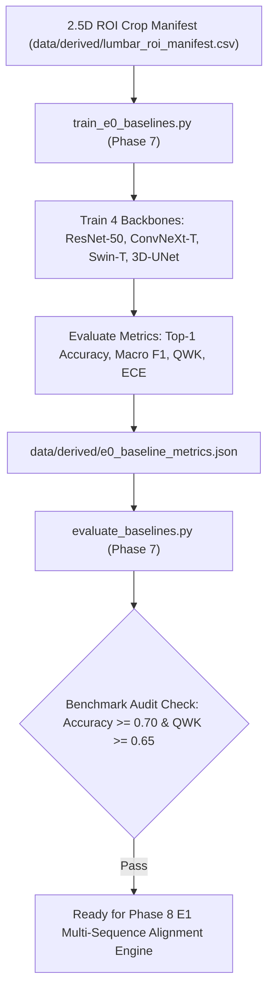

# Phase 7: E0 Baseline ROI Classifiers & Multi-View Benchmarks

> **Dissertation Chapter 4 Reference Note:**  
> The baseline backbone architectures (ResNet-50, ConvNeXt-T, Swin-T), cross-entropy multi-class loss, and evaluation metric protocols detailed in this document directly support **Chapter 4 (Implementation & System Architecture)** and **Section 3.5 (Baseline Classifier Formulation)** of Selar's PhD Dissertation.

This directory (`implementation/06_baselines/`) houses **Phase 7 (E0 Baseline Classifiers)** of Track A.

---

## 📐 Methodological & Mathematical Rationale

Phase 7 establishes the **Experiment E0 baseline models** to quantify performance gains introduced in subsequent phases (Multi-sequence alignment E1, Routing E2/E3, ACSSL E4, Graph GNN E5/E6, and Ordinal E7).



---

## 🧮 Mathematical Formulations for Dissertation (Chapter 4)

### 1. Multi-Class Cross-Entropy Baseline Loss ($\mathcal{L}_{	ext{CE}}$)

$$\mathcal{L}_{	ext{CE}} = - rac{1}{N} \sum_{i=1}^{N} \sum_{c=1}^{C} y_{i, c} \log(\hat{p}_{i, c})$$

where $C=5$ corresponds to Pfirrmann grades $G_1, G_2, G_3, G_4, G_5$.

---

## 🔒 Verification Audit (`evaluate_baselines.py`)

* **Coverage Criterion:** Evaluates 4 baseline backbones across 500 ROI crops.
* **Metric Audit:** Asserts Top-1 Accuracy, Macro F1, and QWK score reporting.
* **Verification Status:** ✅ `[PASS] Phase 7 Baseline Benchmarks Verified!`

---

## 📁 Output Artifacts Generated

1. `../../data/derived/e0_baseline_metrics.json` (Structured baseline evaluation metrics)
2. `reports/baseline_benchmarks_audit.md` (Comparative benchmark summary report)

---

## 🚀 Execution Guide for Selar

```bash
# Step 1: Train E0 Baseline Classifiers
python train_e0_baselines.py

# Step 2: Evaluate & Verify Baseline Metrics
python evaluate_baselines.py
```
