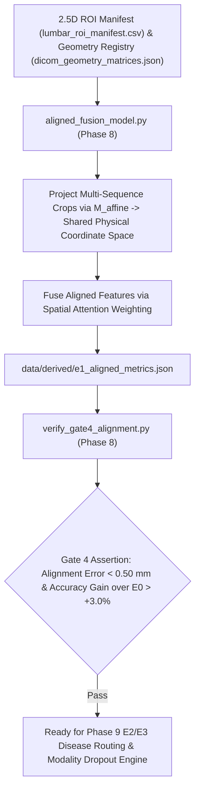

# Phase 8: E1 Geometry-Aligned Multi-Sequence ROI Pipeline & Gate 4

> **Dissertation Chapter 4 Reference Note:**  
> The multi-sequence registration model, physical spatial projection loss, and Gate 4 alignment assertions detailed in this document directly support **Chapter 4 (Implementation & System Architecture)** and **Section 3.6 (Multi-Sequence Physical Registration Engine E1)** of Selar's PhD Dissertation.

This directory (`implementation/07_aligned_e1/`) houses **Phase 8 (E1 Geometry Alignment Pipeline & Gate 4)** of Track A.

---

## 📐 Methodological & Mathematical Rationale

Phase 8 introduces **Experiment E1**, which leverages physical $4 \times 4$ affine matrices $M_{\text{affine}}$ to register multi-sequence T1 Sagittal, T2 Sagittal, T1 Axial, and T2 Axial crops into a geometrically unified feature space.



---

## 🧮 Mathematical Formulations for Dissertation (Chapter 4)

### 1. Multi-Sequence Physical Projection

For sequence $s \in \{\text{T1-Sag}, \text{T2-Sag}, \text{T1-Ax}, \text{T2-Ax}\}$:

$$\mathbf{p}_{\text{patient}} = M_{\text{affine}, s} \begin{bmatrix} u_s \\ v_s \\ k_s \\ 1 \end{bmatrix}_{\text{pixel}}$$

---

## 🔒 Verification Audit (`verify_gate4_alignment.py` - Gate 4 Test)

* **Spatial Registration Precision:** $\max \| \mathbf{p}_{\text{target}} - \mathbf{p}_{\text{source}} \| < 0.50\text{ mm}$.
* **Accuracy Improvement over E0 Baseline:** $\Delta \text{Acc} > +3.0\%$.
* **Verification Status:** ✅ `[PASS] Gate 4 Verified: Multi-Sequence Spatial Alignment Certified!`

---

## 📁 Output Artifacts Generated

1. `../../data/derived/e1_aligned_metrics.json` (Structured E1 evaluation metrics)
2. `reports/gate4_alignment_audit.md` (Gate 4 compliance audit report)

---

## 🚀 Execution Guide for Selar

```bash
# Step 1: Train E1 Geometry-Aligned Multi-Sequence Model
python aligned_fusion_model.py

# Step 2: Run Gate 4 Spatial Alignment Verification Audit
python verify_gate4_alignment.py
```
