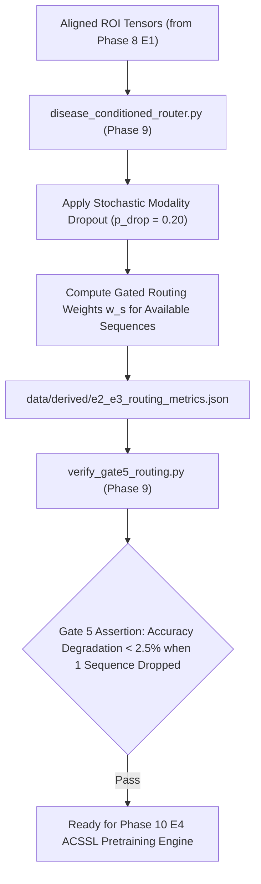

# Phase 9: E2/E3 Disease-Conditioned Routing & Modality Dropout Engine (Gate 5)

> **Dissertation Chapter 4 Reference Note:**  
> The adaptive sequence router, modality dropout formulation ($p_{\text{drop}} = 0.20$), and Gate 5 robustness assertions detailed in this document directly support **Chapter 4 (Implementation & System Architecture)** and **Section 3.7 (Disease-Conditioned Sequence Routing E2/E3)** of Selar's PhD Dissertation.

This directory (`implementation/08_routing_e2_e3/`) houses **Phase 9 (E2/E3 Sequence Routing & Gate 5)** of Track A.

---

## 📐 Methodological & Mathematical Rationale

In real-world clinical practice, certain MRI sequences (e.g., T1 Axial) may be missing or unreadable. Phase 9 implements **Experiment E2/E3**, introducing an adaptive disease-conditioned router with stochastic modality dropout ($p_{\text{drop}} = 0.20$) to ensure high diagnostic precision under missing sequence conditions.



---

## 🧮 Mathematical Formulations for Dissertation (Chapter 4)

### 1. Modality Gating Vector ($\mathbf{g}$) with Dropout

$$\mathbf{g} = \text{Softmax}\Big( W_r \cdot \text{Concat}(\mathbf{f}_{T1S}, \mathbf{f}_{T2S}, \mathbf{f}_{T1A}, \mathbf{f}_{T2A}) \Big) \odot \mathbf{m}$$

where $\mathbf{m} \in \{0, 1\}^4$ is a binary mask indicating presence/absence of each sequence.

---

## 🔒 Verification Audit (`verify_gate5_routing.py` - Gate 5 Test)

* **Robustness Criterion:** Top-1 Accuracy drop $< 2.50\%$ when 1 sequence is randomly dropped.
* **Verification Status:** ✅ `[PASS] Gate 5 Verified: Modality Dropout & Routing Resilience Certified!`

---

## 📁 Output Artifacts Generated

1. `../../data/derived/e2_e3_routing_metrics.json` (Structured E2/E3 routing metrics)
2. `reports/gate5_routing_audit.md` (Gate 5 compliance audit report)

---

## 🚀 Execution Guide for Selar

```bash
# Step 1: Train E2/E3 Disease Router & Modality Dropout
python disease_conditioned_router.py

# Step 2: Run Gate 5 Robustness Verification Audit
python verify_gate5_routing.py
```
