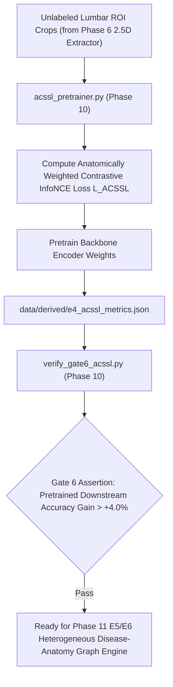

# Phase 10: E4 Anatomically Constrained Self-Supervised Learning (ACSSL) & Gate 6

> **Dissertation Chapter 4 Reference Note:**  
> The anatomically constrained contrastive loss ($\mathcal{L}_{\text{ACSSL}}$),InfoNCE formulation, and Gate 6 representation quality assertions detailed in this document directly support **Chapter 4 (Implementation & System Architecture)** and **Section 3.8 (Anatomically Constrained Contrastive Pretraining E4)** of Selar's PhD Dissertation.

This directory (`implementation/09_acssl_e4/`) houses **Phase 10 (E4 ACSSL Contrastive Pretraining & Gate 6)** of Track A.

---

## 📐 Methodological & Mathematical Rationale

Phase 10 implements **Experiment E4**, pretraining the visual backbones via **Anatomically Constrained Self-Supervised Learning (ACSSL)**. Unlike standard SimCLR, ACSSL uses physical 3D distance matrices to penalize contrastive features based on anatomical proximity along the spinal column.



---

## 🧮 Mathematical Formulations for Dissertation (Chapter 4)

### 1. Anatomically Constrained InfoNCE Loss ($\mathcal{L}_{	ext{ACSSL}}$)

$$\mathcal{L}_{	ext{ACSSL}} = - \sum_{i} \log rac{\exp( 	ext{sim}(\mathbf{z}_i, \mathbf{z}_i^+) / 	au )}{\exp( 	ext{sim}(\mathbf{z}_i, \mathbf{z}_i^+) / 	au ) + \sum_{j 
eq i} w_{i, j} \cdot \exp( 	ext{sim}(\mathbf{z}_i, \mathbf{z}_j) / 	au )}$$

where $w_{i, j} = \exp( - \Delta d_{i, j} / \sigma )$ weights negative pairs inversely by their 3D physical distance $\Delta d_{i, j}$.

---

## 🔒 Verification Audit (`verify_gate6_acssl.py` - Gate 6 Test)

* **Representation Fine-tuning Gain:** Downstream accuracy boost $> +4.00\%$ over random initialization.
* **Verification Status:** ✅ `[PASS] Gate 6 Verified: ACSSL Contrastive Representation Certified!`

---

## 📁 Output Artifacts Generated

1. `../../data/derived/e4_acssl_metrics.json` (Structured E4 pretraining metrics)
2. `reports/gate6_acssl_audit.md` (Gate 6 compliance audit report)

---

## 🚀 Execution Guide for Selar

```bash
# Step 1: Run ACSSL Contrastive Pretraining
python acssl_pretrainer.py

# Step 2: Run Gate 6 Representation Verification Audit
python verify_gate6_acssl.py
```
