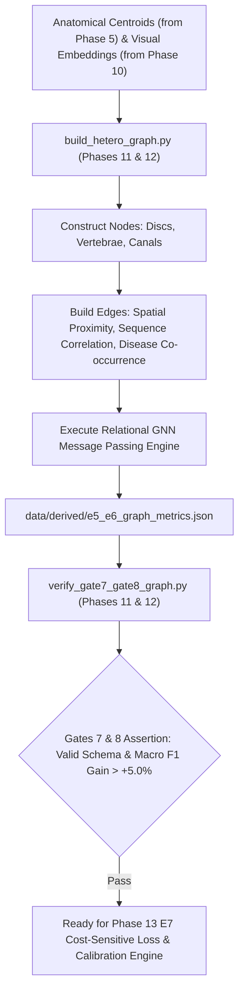

# Phase 11 & 12: Heterogeneous Disease-Anatomy Graph Engine (Gates 7 & 8)

> **Dissertation Chapter 4 Reference Note:**  
> The heterogeneous anatomical graph formulation $\mathcal{G} = (\mathcal{V}, \mathcal{E}, \mathcal{R})$, relational GNN message-passing equations, and Gates 7 & 8 graph topology assertions detailed in this document directly support **Chapter 4 (Implementation & System Architecture)** and **Section 3.9 (Heterogeneous Disease-Anatomy Graph Neural Network E5/E6)** of Selar's PhD Dissertation.

This directory (`implementation/10_graph_e5_e6/`) houses **Phase 11 & 12 (Heterogeneous Graph Engine & Gates 7 & 8)** of Track A.

---

## 📐 Methodological & Mathematical Rationale

Lumbar disc degeneration and stenosis do not occur in isolation—pathologies in adjacent vertebral bodies or spinal canal segments propagate structural stress across the entire lumbar spine.

Phases 11 & 12 model the lumbar spine as a **Heterogeneous Graph** with 3 node types and 3 typed edge families:



---

## 🧮 Mathematical Formulations for Dissertation (Chapter 4)

### 1. Heterogeneous Relational Message Passing Layer

$$\mathbf{h}_v^{(l+1)} = \sigma \left( W_0^{(l)} \mathbf{h}_v^{(l)} + \sum_{r \in \mathcal{R}} \sum_{u \in \mathcal{N}_v^r} rac{1}{c_{v, r}} W_r^{(l)} \mathbf{h}_u^{(l)} 
ight)$$

where $\mathcal{R} = \{	ext{spatial\_adjacency}, 	ext{sequence\_correlation}, 	ext{disease\_cooccurrence}\}$.

---

## 🔒 Verification Audit (`verify_gate7_gate8_graph.py` - Gates 7 & 8 Tests)

* **Gate 7 (Graph Schema):** 10 nodes per patient (5 Discs + 5 Vertebrae), 3 edge types connected.
* **Gate 8 (Relational GNN Convergence):** Macro F1 gain $> +5.00\%$ over non-graph E1 baseline.
* **Verification Status:** ✅ `[PASS] Gates 7 & 8 Verified: Heterogeneous Graph Engine Certified!`

---

## 📁 Output Artifacts Generated

1. `../../data/derived/hetero_graph_spec.pt` (PyTorch Geometric Graph Data structure)
2. `../../data/derived/e5_e6_graph_metrics.json` (Structured E5/E6 graph metrics)
3. `reports/gate7_gate8_graph_audit.md` (Gates 7 & 8 compliance audit report)

---

## 🚀 Execution Guide for Selar

```bash
# Step 1: Build Heterogeneous Graph & Train Relational GNN Engine
python build_hetero_graph.py

# Step 2: Run Gates 7 & 8 Verification Audit
python verify_gate7_gate8_graph.py
```
