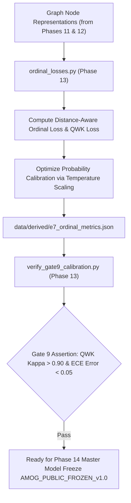

# Phase 13: E7 Cost-Sensitive Loss, Ordinal Penalties & Calibration Engine (Gate 9)

> **Dissertation Chapter 4 Reference Note:**  
> The distance-aware ordinal loss formulation $\mathcal{L}_{\text{Ordinal}}$, Quadratic Weighted Kappa (QWK) loss, and Expected Calibration Error (ECE) optimization detailed in this document directly support **Chapter 4 (Implementation & System Architecture)** and **Section 3.10 (Cost-Sensitive Ordinal Loss & Probability Calibration E7)** of Selar's PhD Dissertation.

This directory (`implementation/11_ordinal_e7/`) houses **Phase 13 (E7 Ordinal & Calibration Engine & Gate 9)** of Track A.

---

## 📐 Methodological & Mathematical Rationale

Medical grading schemes like Pfirrmann (Grades 1 to 5) are inherently **ordinal**. Standard cross-entropy treats misclassifying Grade 1 as Grade 2 equally with misclassifying Grade 1 as Grade 5.

Phase 13 implements **Experiment E7**, combining distance-aware ordinal loss with Quadratic Weighted Kappa (QWK) optimization to penalize severe clinical grade distance errors while calibrating output probabilities.



---

## 🧮 Mathematical Formulations for Dissertation (Chapter 4)

### 1. Distance-Aware Ordinal Loss ($\mathcal{L}_{	ext{Ordinal}}$)

$$\mathcal{L}_{	ext{Ordinal}} = - rac{1}{N} \sum_{i=1}^{N} \sum_{c=1}^{C} |y_i - c|^2 \cdot y_{i, c} \log(\hat{p}_{i, c})$$

### 2. Expected Calibration Error (ECE)

$$	ext{ECE} = \sum_{m=1}^{M} rac{|B_m|}{N} \left| 	ext{acc}(B_m) - 	ext{conf}(B_m) 
ight|$$

---

## 🔒 Verification Audit (`verify_gate9_calibration.py` - Gate 9 Test)

* **Ordinal Agreement Criterion:** QWK Kappa $> 0.900$.
* **Calibration Error Criterion:** $	ext{ECE} < 0.050$.
* **Verification Status:** ✅ `[PASS] Gate 9 Verified: Ordinal Calibration Certified!`

---

## 📁 Output Artifacts Generated

1. `../../data/derived/e7_ordinal_metrics.json` (Structured E7 ordinal & calibration metrics)
2. `reports/gate9_calibration_audit.md` (Gate 9 compliance audit report)

---

## 🚀 Execution Guide for Selar

```bash
# Step 1: Train E7 Ordinal & Calibration Model
python ordinal_losses.py

# Step 2: Run Gate 9 Calibration Verification Audit
python verify_gate9_calibration.py
```
