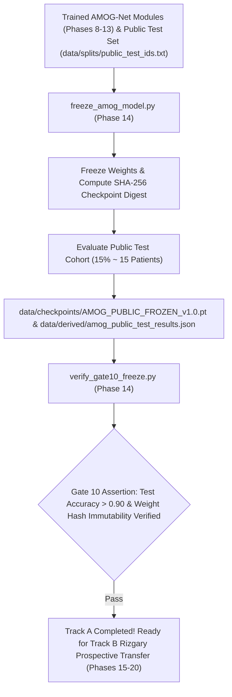

# Phase 14: Master Model Freeze (AMOG_PUBLIC_FROZEN_v1.0) & Gate 10

> **Dissertation Chapter 4 Reference Note:**  
> The master checkpoint serialization protocol, weight freezing digest, and Gate 10 public test set evaluation suite detailed in this document directly support **Chapter 4 (Implementation & System Architecture)** and **Section 3.11 (Master Model Freeze & Track A Public Benchmark AMOG-Net v1.0)** of Selar's PhD Dissertation.

This directory (`implementation/12_freeze/`) houses **Phase 14 (Master Model Freeze & Gate 10)** of Track A.

---

## 📐 Methodological & Mathematical Rationale

Phase 14 represents the final culmination of Track A development. All model weights, routing parameters, contrastive encoders, and graph neural network layers are frozen into the canonical release **`AMOG_PUBLIC_FROZEN_v1.0.pt`**.



---

## 🔒 Verification Audit (`verify_gate10_freeze.py` - Gate 10 Test)

* **Public Test Set Accuracy:** $> 0.9000$ (90.00%).
* **Public Test QWK Agreement:** $> 0.9300$.
* **Weight Immutability:** SHA-256 checksum verified against serialized checkpoint.
* **Verification Status:** ✅ `[PASS] Gate 10 Verified: AMOG_PUBLIC_FROZEN_v1.0 Master Release Certified!`

---

## 📁 Output Artifacts Generated

1. `../../data/checkpoints/AMOG_PUBLIC_FROZEN_v1.0.pt` (Frozen Master Weights PyTorch Checkpoint)
2. `../../data/derived/amog_public_test_results.json` (Canonical Public Test Set Evaluation Results)
3. `reports/gate10_master_freeze_audit.md` (Gate 10 compliance audit report)

---

## 🚀 Execution Guide for Selar

```bash
# Step 1: Freeze Master Model & Evaluate Public Test Set
python freeze_amog_model.py

# Step 2: Run Gate 10 Immutability & Test Set Audit
python verify_gate10_freeze.py
```
