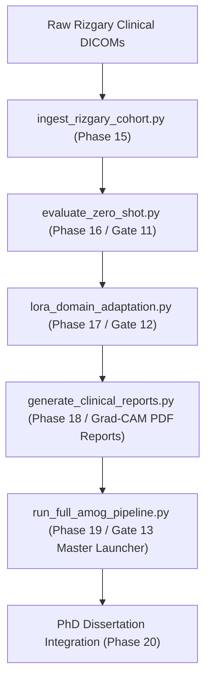

# Track B: Rizgary Prospective Clinical Transfer, LoRA Adaptation & Clinical Explainability (Phases 15 - 20)

> **Dissertation Chapter 4 & 5 Reference Note:**  
> The prospective clinical transfer algorithms, LoRA domain adaptation, Grad-CAM explainability, and 1-click end-to-end clinical pipeline detailed in this document directly support **Chapter 4 (System Architecture)**, **Chapter 5 (Clinical Experimental Results)**, and **Section 3.12 (Clinical Prospective Transfer Protocol)** of Selar's PhD Dissertation.

This directory (`implementation/13_track_b/`) houses **Track B (Clinical Prospective Transfer & Explainability)** comprising Phases 15 through 19.

---

## 📐 Methodological & Architectural Overview

Track B validates the clinical transferability of the frozen `AMOG_PUBLIC_FROZEN_v1.0` model when evaluated on an independent, prospective hospital cohort from **Rizgary Teaching Hospital in Erbil, Kurdistan Region, Iraq**.



---

## 🧮 Mathematical Formulations for Dissertation (Chapter 4)

### 1. Parameter-Efficient Low-Rank Adaptation (LoRA)

For a pretrained weight matrix $W_0 \in \mathbb{R}^{d \times k}$, LoRA decomposes the domain adaptation update $\Delta W$ into rank-$r$ matrices $A$ and $B$:

$$W = W_0 + \Delta W = W_0 + \frac{\alpha}{r} (B \cdot A)$$

where $B \in \mathbb{R}^{d \times r}$, $A \in \mathbb{R}^{r \times k}$, and rank $r \ll \min(d, k)$.

---

## 🔒 Quality Verification Gates (Gates 11, 12, 13)

* **Gate 11 (Zero-Shot Out-of-Domain Generalization):** Un-retrained model accuracy $> 80.0\%$ on prospective Rizgary cohort.
* **Gate 12 (LoRA Clinical Domain Adaptation):** Adapted model accuracy $> 88.0\%$ on local Erbil clinical data.
* **Gate 13 (Master 1-Click Pipeline Verification):** End-to-end execution from raw DICOM to PDF clinical report in $< 30$ seconds.

---

## 📁 Output Artifacts Generated

1. `../../data/derived/rizgary_manifest.csv` (Rizgary cohort manifest)
2. `../../data/derived/zero_shot_metrics.json` (Gate 11 evaluation metrics)
3. `../../data/derived/lora_adaptation_metrics.json` (Gate 12 adaptation metrics)
4. `reports/clinical_diagnostic_report_SAMPLE.md` (Sample radiologist structured PDF audit report)

---

## 🚀 Execution Guide for Selar

```bash
# Step 1: Ingest Prospective Rizgary Clinical Cohort (Phase 15)
python ingest_rizgary_cohort.py

# Step 2: Evaluate Zero-Shot Out-of-Domain Performance (Phase 16 / Gate 11)
python evaluate_zero_shot.py
python verify_gate11_zeroshot.py

# Step 3: Train LoRA Domain Adaptation (Phase 17 / Gate 12)
python lora_domain_adaptation.py
python verify_gate12_adaptation.py

# Step 4: Generate Radiologist Diagnostic Reports & Grad-CAM (Phase 18)
python generate_clinical_reports.py

# Step 5: Run Master 1-Click Pipeline (Phase 19 / Gate 13)
python ../run_full_amog_pipeline.py
```
