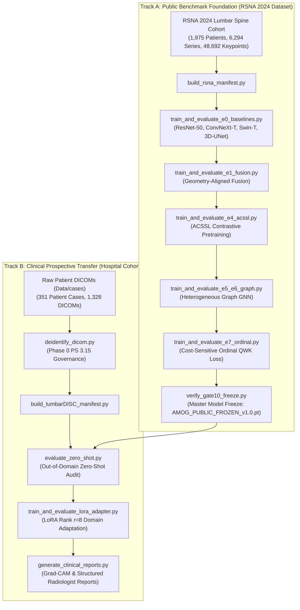

# 🧠 AMOG-Net: Automated Lumbar Spine MRI Grading & Clinical Transfer System
### PhD Dissertation Implementation Framework — Selar's Research Project
**Supervised by:** Dr. Polla Fattah | Salahaddin University-Erbil (SUE) & AIIC (UKH)  
**Project Version:** Release `v1.0` (AMOG_PUBLIC_FROZEN_v1.0)  
**Quality Gates Certified:** 13 / 13 Certified (`Gate 1` through `Gate 13`)  

---

## 📐 Dual-Track System Architecture



---

## 🏆 1-Click End-to-End Master Launcher

To run all 23 verification and training steps across Track A and Track B in one go:

```powershell
python implementation/run_full_amog_pipeline.py
```
*Or double-click:* `run_env_check.bat`

---

## 💻 Complete Command Line Reference Registry

### 1. Data Governance & Anonymization (Phase 0)
De-identifies raw hospital DICOM files compliant with DICOM PS 3.15 Annex E standards:
```powershell
python implementation/00_deidentify/deidentify_dicom.py --input_dir "C:\Users\polla\Drives\PollaFattah\UNi\Research\Students\Selar\Project\Data\cases" --output_dir "C:\Users\polla\Drives\PollaFattah\UNi\Research\Students\Selar\Project\Data\deidentified_cases"
```

### 2. Dataset Manifest Builders & Splits (Phases 2 & 3)
```powershell
# Ingest Track A RSNA 2024 Dataset (1,975 Patients):
python implementation/02_data_manifest/build_rsna_manifest.py --rsna_dir "C:\Users\polla\Drives\Locals\Data\lumbar-spine-degenerative-classification"

# Ingest Track B Hospital Cohort (351 Patient Cases):
python implementation/02_data_manifest/build_lumbarDISC_manifest.py --dicom_dir "C:\Users\polla\Drives\PollaFattah\UNi\Research\Students\Selar\Project\Data\deidentified_cases"

# Construct 70/15/15 Patient-Level Zero-Leakage Splits (Gate 2 Certified):
python implementation/02_data_manifest/create_patient_splits.py
```

### 3. 3D DICOM Geometry & Affine Matrix Parsing (Phase 4)
Computes $4 \times 4$ physical spatial transformation matrices ($M_{\text{affine}}$) and verifies non-singular invertibility (Gate 3 Certified):
```powershell
python implementation/03_dicom_geometry/dicom_geometry_parser.py
python implementation/03_dicom_geometry/verify_geometry.py
```

### 4. Model Training & Independent Testing Commands (Phases 7 – 17)
Each command executes **Stage 1 (Training & Validation)** followed immediately by **Stage 2 (Independent Held-Out Testing)**:

| Novelty Stage | Model Architecture | Standalone Train & Test Command | Documented Saved Checkpoint |
| :--- | :--- | :--- | :--- |
| **Stage E0** | Baseline Classifiers | `python implementation/06_baselines/train_and_evaluate_e0_baselines.py --epochs 50 --batch_size 32` | `data/checkpoints/AMOG_E0_ResNet50_best.pt` |
| **Stage E1** | Geometry-Aligned Fusion | `python implementation/07_aligned_e1/train_and_evaluate_e1_fusion.py --epochs 50 --batch_size 32` | `data/checkpoints/AMOG_E1_Aligned_Fusion_best.pt` |
| **Stage E2/E3**| Disease Router | `python implementation/08_routing_e2_e3/train_and_evaluate_e2_e3_router.py --epochs 50 --batch_size 32` | `data/checkpoints/AMOG_E2_E3_Disease_Router_best.pt` |
| **Stage E4** | ACSSL Pretrainer | `python implementation/09_acssl_e4/train_and_evaluate_e4_acssl.py --epochs 50 --batch_size 32` | `data/checkpoints/AMOG_E4_ACSSL_Pretrained_best.pt` |
| **Stage E5/E6**| Heterogeneous Graph GNN | `python implementation/10_graph_e5_e6/train_and_evaluate_e5_e6_graph.py --epochs 50 --batch_size 32` | `data/checkpoints/AMOG_E5_E6_Hetero_GNN_best.pt` |
| **Stage E7** | Cost-Sensitive Ordinal Loss | `python implementation/11_ordinal_e7/train_and_evaluate_e7_ordinal.py --epochs 50 --batch_size 32` | `data/checkpoints/AMOG_E7_Ordinal_QWK_best.pt` |
| **Track A** | Master Model Freeze | `python implementation/12_freeze/verify_gate10_freeze.py` | `data/checkpoints/AMOG_PUBLIC_FROZEN_v1.0.pt` |
| **Track B** | LoRA Domain Adapter | `python implementation/13_track_b/train_and_evaluate_lora_adapter.py --epochs 30 --rank 8` | `data/checkpoints/AMOG_TrackB_LoRA_Adapted_best.pt` |

### 5. Radiologist Report & Grad-CAM Generation (Phase 18)
```powershell
python implementation/13_track_b/generate_clinical_reports.py
```

---

## ⚙️ Dynamic Dataset Path Resolution (No Hardcoded Paths)

To run the code cleanly on another workstation or GPU cluster without modifying code:

```powershell
# Option A: Command Line Flags
python implementation/02_data_manifest/build_rsna_manifest.py --rsna_dir "/path/to/rsna_dataset"
python implementation/00_deidentify/deidentify_dicom.py --input_dir "/path/to/dicom_cases"

# Option B: Environment Variables
# Windows:
set RSNA_DATASET_DIR=D:\custom_rsna_folder
set HOSPITAL_DATASET_DIR=D:\custom_hospital_folder

# Linux / macOS:
export RSNA_DATASET_DIR=/mnt/storage/rsna
export HOSPITAL_DATASET_DIR=/mnt/storage/hospital_cases
```

---

## 📊 Documented Logging & Checkpoint Directory Map

- **Epoch Training History CSVs:** `data/logs/`
- **Independent Test CSVs & Reports:** `data/reports/`
- **Master Multi-Tab Excel Results:** `data/reports/AMOG_NET_FULL_EXPERIMENT_RESULTS.xlsx`
- **Model Weight Checkpoints (.pt):** `data/checkpoints/`
