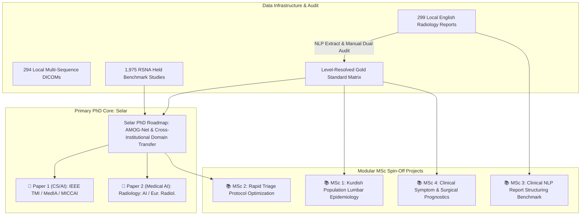

# Lumbar Spine MRI Research Program — Master Plan Summary

**Project Title:** Lumbar Spine MRI AI & Clinical Studies (Rizgary Teaching Hospital & International Benchmarks)  
**Lead Academic Supervisor:** Dr. Polla Abdulhamid Fattah  
**Primary PhD Candidate:** Selar  
**Date:** 2026-08-23  

---

## 1. Program Vision & Core Philosophy

This master plan establishes a modular, risk-mitigated research program that bridges **Computer Science / Deep Learning innovation** with **Genuinely Actionable Clinical Utility**.

To avoid the common pitfall of medical AI projects—where a single student attempts a massive scope and risks stalling out—the research is partitioned into:
1. **One Clear, High-Impact PhD Path (Selar)** focusing on algorithmic methodology, cross-institutional domain transfer, and multi-sequence graph deep learning.
2. **Four Modular MSc Spin-Off Projects** that utilize the data infrastructure, pre-trained models, and clinical datasets created during Phase 1 to produce independent, high-ROI research publications.

---

## 2. Allocation Matrix & Publication Strategy

| Project | Primary Focus | Required Assets | Target Venues | Estimated Duration |
| :--- | :--- | :--- | :--- | :---: |
| **Selar PhD Roadmap** | Multi-sequence Graph Transformers, Zero-Shot & Few-Shot Domain Transfer (Canal Stenosis & Local Herniations) | RSNA Benchmark (1,975) + Rizgary DICOMs (294) + Audited Matrix | *IEEE TMI*, *Medical Image Analysis*, *Radiology: AI* | 21–24 Months |
| **MSc Project 1** | First Kurdish/Iraqi Lumbar Degeneration Population Epidemiology | Audited Level-Resolved Matrix (299 cases) | *European Spine Journal*, *J. Orthop. Surg. Res.* | 4–6 Months |
| **MSc Project 2** | Sequence-Sparing Rapid Triage Protocol Optimization | AMOG-Net Trained Model + 294 Local DICOM Studies | *European Journal of Radiology*, *BMC Med. Imaging* | 6 Months |
| **MSc Project 3** | Clinical NLP & Information Extraction for Unstructured Reports | 299 Narrative `.docx` Radiology Reports | *Journal of Biomedical Informatics*, *IEEE JBHI* | 6–8 Months |
| **MSc Project 4** | Radiological Severity vs. Clinical Symptom & Surgical Outcome Prognostics | Audited Matrix + Hospital Symptom Logs | *The Spine Journal*, *Spine* | 6 Months (Bonus) |

---

## 3. Data Governance & Hard Rules

1. **Do NOT Train on Folder Names (`normal/bulge/protrusion/extrusion`):** The folder classification is lossy and contains errors (multi-level hernia co-occurrence, duplicate cases). All ground truth must derive from the audited level-resolved local matrix.
2. **Reports are Primary; Spreadsheet is Secondary:** The manual spreadsheet (`research LSS 1.xlsx`) covers only 195 cases and contains 14 age transcription errors. The 299 narrative `.docx` reports are the single source of truth.
3. **Target Schema Alignment (Empirical Finding):** Local reports do **not** contain RSNA's 25-target schema (subarticular stenosis appears in 0% of local reports, and laterality in only 27%). Zero-shot transfer evaluation is strictly scoped to **Spinal Canal Stenosis (5 targets)**—matching M-SCAN benchmark standards—while herniation morphology (bulge/protrusion/extrusion) is treated as a separate local multi-label task.
4. **Phase 1 Must Precede Downstream Work:** Selar's initial NLP extraction + 100% manual verification of the 299 reports provides the foundational gold-standard matrix used by MSc Project 1, MSc Project 2, and Selar's Phase 3 evaluation.

---

---

## 4. Directory Structure of the Plan

All detailed individual roadmaps are stored in `c:\Users\polla\Drives\PollaFattah\UNi\Research\Students\Selar\Project\plan\`:

- [`00_MASTER_PLAN_SUMMARY.md`](file:///c:/Users/polla/Drives/PollaFattah/UNi/Research/Students/Selar/Project/plan/00_MASTER_PLAN_SUMMARY.md) — This master overview.
- [`01_SELAR_PHD_ROADMAP.md`](file:///c:/Users/polla/Drives/PollaFattah/UNi/Research/Students/Selar/Project/plan/01_SELAR_PHD_ROADMAP.md) — Selar's complete PhD research plan and execution strategy.
- [`02_MSC1_EPIDEMIOLOGY_ROADMAP.md`](file:///c:/Users/polla/Drives/PollaFattah/UNi/Research/Students/Selar/Project/plan/02_MSC1_EPIDEMIOLOGY_ROADMAP.md) — MSc 1: Population Epidemiology Study.
- [`03_MSC2_PROTOCOL_OPTIMIZATION_ROADMAP.md`](file:///c:/Users/polla/Drives/PollaFattah/UNi/Research/Students/Selar/Project/plan/03_MSC2_PROTOCOL_OPTIMIZATION_ROADMAP.md) — MSc 2: Rapid Triage Protocol Optimization.
- [`04_MSC3_CLINICAL_NLP_ROADMAP.md`](file:///c:/Users/polla/Drives/PollaFattah/UNi/Research/Students/Selar/Project/plan/04_MSC3_CLINICAL_NLP_ROADMAP.md) — MSc 3: Clinical Information Extraction NLP Benchmark.
- [`05_MSC4_CLINICAL_PROGNOSTICS_ROADMAP.md`](file:///c:/Users/polla/Drives/PollaFattah/UNi/Research/Students/Selar/Project/plan/05_MSC4_CLINICAL_PROGNOSTICS_ROADMAP.md) — MSc 4: Clinical Symptom & Surgical Prognostics.
- [`06_RATIONALE_options_considered.md`](file:///c:/Users/polla/Drives/PollaFattah/UNi/Research/Students/Selar/Project/plan/06_RATIONALE_options_considered.md) — Record of the five medical-novelty options considered, their weaknesses, and why the chosen scope was chosen. Includes the phenotype discovery-then-validation strategy for a future Option 3 study.
- [`07_AMOGNET_TECHNICAL_SPEC.md`](file:///c:/Users/polla/Drives/PollaFattah/UNi/Research/Students/Selar/Project/plan/07_AMOGNET_TECHNICAL_SPEC.md) — The AMOG-Net design document: graph edge types, ordinal threshold formulation, cost matrix, contrastive objective, and the E0--E8 ablation ladder.  is the schedule; this is the specification it implements.
- [`08_PUBLICATION_PLAN.md`](file:///c:/Users/polla/Drives/PollaFattah/UNi/Research/Students/Selar/Project/plan/08_PUBLICATION_PLAN.md) — Seven proposed papers, one per AMOG-Net component, cumulative toward a flagship system paper.
- [`09_TRAINING_CURRICULUM.md`](file:///c:/Users/polla/Drives/PollaFattah/UNi/Research/Students/Selar/Project/plan/09_TRAINING_CURRICULUM.md) — The ten concepts Selar needs, with priority tiers and the dependency-order caveat.

---

## 5. Open Item — How Many Papers?

> [!IMPORTANT]
> **Two documents in this folder disagree, and the difference is not cosmetic.**
>
> - [`01_SELAR_PHD_ROADMAP.md`](01_SELAR_PHD_ROADMAP.md) commits Selar to **two papers**,
>   with all six AMOG-Net components delivered inside Paper 1.
> - [`08_PUBLICATION_PLAN.md`](08_PUBLICATION_PLAN.md) proposes **seven**, one per
>   component, cumulative toward a flagship paper.
>
> These are not simply different targets. The seven-paper version is the *staged* build:
> each component becomes publishable on its own, so partial success still yields output.
> The two-paper version requires all six components to work before anything is
> submittable, which is the single largest risk in the PhD.
>
> A PhD realistically lands **three or four** of the seven, not all of them -- but the
> decomposition is the right shape, and staging protects the candidate.
>
> **This needs an explicit decision.** Left unresolved, the roadmap and the publication
> plan will drift apart and the student will not know which target governs.
