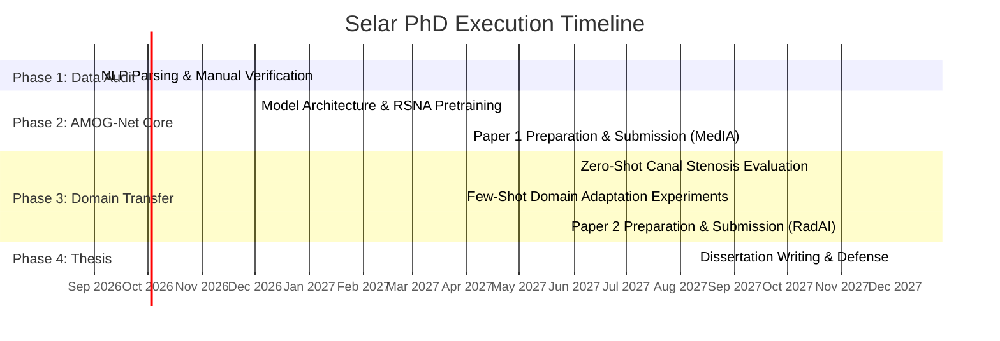

# PhD Research Plan — Candidate: Selar

**Thesis Title:** Cross-Institutional Domain-Transferable Graph Deep Learning for Multi-Sequence Lumbar Spine MRI Assessment  
**Supervisor:** Dr. Polla Abdulhamid Fattah  
**Target Degree:** PhD in Computer Science / Artificial Intelligence  
**Duration:** 21–24 Months  

---

## 1. Executive Summary & Research Scope

This PhD project addresses a major challenge in clinical medical imaging AI: **cross-institutional generalizability and multi-sequence fusion for multi-label anatomical structures.**

Rather than getting bogged down in localized clinical data collection or broad non-technical epidemiology, Selar's PhD focuses on a sharp methodological core:
1. Developing **AMOG-Net** (Anatomical Multi-sequence Ordinal Graph Network), trained on international benchmark datasets (**RSNA LumbarDISC Kaggle release**, $N=1,975$ held studies).
2. Quantifying and solving domain transfer degradation when evaluating on a regional, unseen single-center clinical cohort (**Rizgary Teaching Hospital**, $N=294$).
3. **Target Schema Scoping:** Evaluating zero-shot transfer on **Spinal Canal Stenosis (5 targets: L1-L2 through L5-S1)**—which appears in 97% of local reports and directly matches benchmark papers like M-SCAN—while treating local herniation morphology as a separate multi-label classification task.
4. Formulating a **Few-Shot Domain Adaptation** mechanism that enables clinical models to adapt to local scanner protocols with minimal local labeling effort.

---

## 2. Research Questions (RQs)

* **RQ1 (Multi-Sequence Graph Fusion):** How can spatial dependencies across lumbar levels ($L1\text{--}L2 \dots L5\text{--}S1$) and multi-sequence MRI views (Sagittal T1, Sagittal T2, Axial T2) be jointly modeled to improve multi-label stenosis grading accuracy over standard 2D/3D CNNs?
* **RQ2 (Domain Shift & Schema Alignment):** What is the exact magnitude of performance degradation (zero-shot transfer loss) when evaluating an RSNA-trained model on local Middle Eastern clinical scanners for spinal canal stenosis (5 targets)?
* **RQ3 (Few-Shot Adaptation Efficiency):** How many local cases ($N \in \{10, 25, 50, 100\}$) are required under parameter-efficient fine-tuning (PEFT/Adapter modules) to recover $\ge 95\%$ of benchmark diagnostic accuracy on local hospital data?

---

## 3. Four-Phase Work Plan & Timeline

### Phase 1: Ground Truth Audit & Infrastructure (Months 1–3)
- **Task 1.1:** Develop the NLP report extraction script to parse 299 English `.docx` reports into a level-resolved matrix.
- **Task 1.2 (Mandatory Verification):** Perform a 100% manual verification pass on all non-normal extracted findings against the raw text to produce the official **Rizgary Gold Standard Matrix** (focusing on canal stenosis, foraminal narrowing, and herniation morphology).
- **Task 1.3:** Preprocess and harmonize the **RSNA LumbarDISC** held DICOM dataset ($N=1,975$) and **SPIDER** segmentation masks.

### Phase 2: AMOG-Net Development & Benchmark Training (Months 4–10)
- **Task 2.1:** Implement **AMOG-Net**:
  - *Slice-to-Volume ROI Extractor:* 2.5D crop around intervertebral discs and central canal.
  - *Cross-Sequence Feature Fusion:* Attention mechanism combining Sagittal T1, Sagittal T2, and Axial T2 features.
  - *Anatomical Graph Transformer:* Nodes represent lumbar levels ($L1\text{--}L2 \dots L5\text{--}S1$), edges represent biomechanical coupling.
  - *Ordinal & Uncertainty Loss:* Ordinal cross-entropy loss for stenosis grading + Monte Carlo Dropout / Evidential Loss for confidence estimation.
- **Task 2.2:** Train and validate on RSNA benchmark ($N=1,975$). Compare against standard ResNet, Swin UNETR, and M-SCAN baseline architectures.
- **Deliverable — Paper 1:** *"AMOG-Net: Anatomical Graph Transformers for Multi-Sequence Lumbar Spine MRI Assessment."*  
  *Target Venues:* *IEEE Transactions on Medical Imaging (TMI)*, *Medical Image Analysis (MedIA)*, or *MICCAI*.

### Phase 3: Zero-Shot Transfer & Few-Shot Domain Adaptation (Months 11–16)
- **Task 3.1 (Zero-Shot Evaluation):** Deploy RSNA-trained AMOG-Net directly onto the 294 Rizgary DICOM studies for Spinal Canal Stenosis (5 targets) without local tuning. Measure macro F1, AUROC, and class-wise sensitivity degradation per spinal level.
- **Task 3.2 (Domain Shift Analysis):** Analyze root causes of domain shift (slice thickness differences, Siemens Avanto magnetic field artifacts, regional anatomical variations).
- **Task 3.3 (Few-Shot Adaptation):** Implement parameter-efficient domain adaptation (Adapter modules / LoRA fine-tuning) using subsets of local cases ($N=10, 25, 50, 100$). Plot efficiency curves showing performance recovery vs. annotation cost.
- **Deliverable — Paper 2:** *"Cross-Institutional Generalizability of Multi-Sequence Lumbar MRI Models: Zero-Shot vs Few-Shot Transfer to a Middle Eastern Cohort."*  
  *Target Venues:* *Radiology: Artificial Intelligence*, *European Radiology*, or *Computers in Biology and Medicine*.

### Phase 4: Dissertation Synthesis & Defense (Months 17–24)
- **Task 4.1:** Write the comprehensive PhD dissertation combining Phase 1–3 methodology, benchmarks, and clinical validation.
- **Task 4.2:** Internal review, thesis submission, and viva voce defense.

---

## 4. Key Performance Indicators & Graduation Criteria

1. **Publications:** At least 2 accepted high-impact peer-reviewed journal papers (1 CS/AI focused, 1 Medical AI focused).
2. **Open Data / Code:** Release cleaned AMOG-Net codebase with reproducible pre-trained weights.
3. **Robustness:** Model must demonstrate statistically verified cross-institutional performance recovery ($\ge 90\%$ AUROC) on local clinical data using $\le 50$ local fine-tuning cases.

---

## 5. Risk Management & Fallback Strategies

| Potential Risk | Severity | Mitigation Strategy |
| :--- | :---: | :--- |
| Zero-shot performance on Rizgary drops severely (>30% F1 drop) | Medium | Frame this as the primary scientific finding of Paper 2; emphasize the Necessity of Few-Shot Domain Adaptation. |
| Model training on RSNA cases requires excessive compute | Low | Use 2.5D ROI cropping to reduce input memory footprint; leverage mixed-precision (FP16/BF16) training. |
| Schema mismatch on subarticular stenosis | Solved | Scope zero-shot evaluation to Spinal Canal Stenosis (5 targets), matching M-SCAN benchmarks. |
