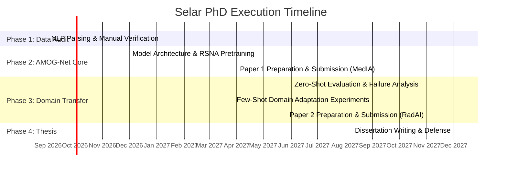

# PhD Research Plan — Candidate: Selar

**Thesis Title:** Cross-Institutional Domain-Transferable Graph Deep Learning for Multi-Sequence Lumbar Spine MRI Assessment  
**Supervisor:** Dr. Polla Abdulhamid Fattah  
**Target Degree:** PhD in Computer Science / Artificial Intelligence  
**Duration:** 21–24 Months  

---

## 1. Executive Summary & Research Scope

This PhD project addresses a major challenge in clinical medical imaging AI: **cross-institutional generalizability and multi-sequence fusion for multi-label anatomical structures.**

Rather than getting bogged down in localized clinical data collection or broad non-technical epidemiology, Selar's PhD focuses on a sharp methodological core:
1. Developing **AMOG-Net** (Anatomical Multi-sequence Ordinal Graph Network), trained on the international benchmark dataset (**RSNA LumbarDISC**, public Kaggle release, $N=1{,}975$ studies held locally).
2. Quantifying and solving domain transfer degradation when evaluating on a regional, unseen single-center clinical cohort (**Rizgary Teaching Hospital**, $N=294$).
3. Formulating a **Few-Shot Domain Adaptation** mechanism that enables clinical models to adapt to local scanner protocols with minimal local labeling effort.

---

## 2. Research Questions (RQs)

* **RQ1 (Multi-Sequence Graph Fusion):** How can spatial dependencies across lumbar levels ($L1\text{--}L2 \dots L5\text{--}S1$) and multi-sequence MRI views (Sagittal T1, Sagittal T2, Axial T2) be jointly modeled to improve multi-label stenosis grading accuracy over standard 2D/3D CNNs?
* **RQ2 (Domain Shift Quantification):** What is the exact magnitude and nature of diagnostic performance degradation (zero-shot transfer loss) when an AI model trained on multinational data is evaluated directly on Middle Eastern clinical scanners?
* **RQ3 (Few-Shot Adaptation Efficiency):** How many local cases ($N \in \{10, 25, 50, 100\}$) are required under parameter-efficient fine-tuning (PEFT/Adapter modules) to recover $\ge 95\%$ of benchmark diagnostic accuracy on local hospital data?

---

## 3. Four-Phase Work Plan & Timeline

### Phase 1: Ground Truth Audit & Infrastructure (Months 1–3)
- **Task 1.1:** Develop the NLP report extraction script to parse 299 English `.docx` reports into a draft local finding matrix (5 levels x the findings the reports actually contain). **This is not RSNA's 25-target schema** -- see the label-coverage note in the Master Plan. Owned jointly with MSc Project 3 to avoid duplicated effort.
- **Task 1.2 (Mandatory Verification):** Perform a 100% manual verification pass on all non-normal extracted findings against the raw text to produce the official **Rizgary Gold Standard Matrix**.
- **Task 1.3:** Preprocess and harmonize the **RSNA LumbarDISC** DICOM dataset ($N=1{,}975$, the public Kaggle release held locally) and the **SPIDER** segmentation masks. NOTE: SPIDER is not yet obtained -- it must be downloaded and its licence terms checked before use, since this is hospital-commissioned work.

### Phase 2: AMOG-Net Development & Benchmark Training (Months 4–10)
- **Task 2.1:** Implement **AMOG-Net**:
  - *Slice-to-Volume ROI Extractor:* 2.5D crop around intervertebral discs and central canal.
  - *Cross-Sequence Feature Fusion:* Attention mechanism combining Sagittal T1, Sagittal T2, and Axial T2 features.
  - *Anatomical Graph Transformer:* Nodes represent lumbar levels ($L1\text{--}L2 \dots L5\text{--}S1$), edges represent biomechanical coupling.
  - *Ordinal & Uncertainty Loss:* Ordinal cross-entropy loss for stenosis grading + Monte Carlo Dropout / Evidential Loss for confidence estimation.
- **Task 2.2:** Train and validate on RSNA benchmark ($N=1{,}975$). Compare against standard ResNet, Swin UNETR, and baseline architectures.
- **Deliverable — Paper 1:** *"AMOG-Net: Anatomical Graph Transformers for Multi-Sequence Lumbar Spine MRI Assessment."*  
  *Target Venues:* *IEEE Transactions on Medical Imaging (TMI)*, *Medical Image Analysis (MedIA)*, or *MICCAI*.

### Phase 3: Zero-Shot Transfer & Few-Shot Domain Adaptation (Months 11–16)
- **Task 3.1 (Zero-Shot Evaluation):** Deploy RSNA-trained AMOG-Net directly onto the 294 Rizgary DICOM studies without local tuning. Measure macro F1, AUROC, and class-wise sensitivity degradation per spinal level.
- **Task 3.2 (Domain Shift Analysis):** Analyze root causes of domain shift (slice thickness differences, Siemens Avanto magnetic field artifacts, regional anatomical variations).
- **Task 3.3 (Few-Shot Adaptation):** Implement parameter-efficient domain adaptation (Adapter modules / LoRA fine-tuning) using subsets of local cases ($N=10, 25, 50, 100$). Plot efficiency curves showing performance recovery vs. annotation cost.
- **Deliverable — Paper 2:** *"Cross-Institutional Generalizability of Multi-Sequence Lumbar MRI Models: Zero-Shot vs Few-Shot Transfer to a Middle Eastern Cohort."*  
  *Target Venues:* *Radiology: Artificial Intelligence*, *European Radiology*, or *Computers in Biology and Medicine*.

### Phase 4: Dissertation Synthesis & Defense (Months 17–24)
- **Task 4.1:** Write the comprehensive PhD dissertation combining Phase 1–3 methodology, benchmarks, and clinical validation.
- **Task 4.2:** Internal review, thesis submission, and viva voce defense.

---

## 4. Key Performance Indicators & Graduation Criteria

1. **Publications:** Two papers **submitted** to the named venues, with at least one
   accepted. Acceptance timing at *IEEE TMI* / *MedIA* is 6--12 months and outside the
   candidate's control, so "two accepted" is not a safe graduation gate on a 21--24 month
   programme. Name a fallback venue for each paper at submission time
   (e.g. *Computers in Biology and Medicine*, *Scientific Reports*).
2. **Open Data / Code:** Release cleaned AMOG-Net codebase with reproducible pre-trained weights.
3. **Robustness:** Characterise cross-institutional transfer quantitatively — report the
   zero-shot degradation and the few-shot recovery curve across $N \in \{10,25,50,100\}$
   local cases.

> [!WARNING]
> **A numeric recovery threshold must not be a graduation criterion.** The earlier version
> of this section required $\ge 90\%$ AUROC recovery using $\le 50$ local cases. If domain
> shift turns out to be severe, that target may be unreachable for reasons that are a
> property of the data, not of the candidate's work — and the risk table below already
> (correctly) says a large drop should be framed as the **primary scientific finding** of
> Paper 2. Those two statements contradicted each other. The finding is the contribution;
> the number is not the bar.

---

## 5. Risk Management & Fallback Strategies

| Potential Risk | Severity | Mitigation Strategy |
| :--- | :---: | :--- |
| Zero-shot performance on Rizgary drops severely (>30% F1 drop) | Medium | Frame this as the primary scientific finding of Paper 2; emphasize the Necessity of Few-Shot Domain Adaptation. |
| Model training on 1,975 RSNA cases requires excessive compute | Medium | Use 2.5D ROI cropping to reduce input memory footprint; leverage mixed-precision (FP16/BF16) training. |
| NLP script makes errors on local reports | Medium | Mandate manual dual-auditing of 100% of local reports during Phase 1 before model evaluation starts. |
| **Ten of RSNA's 25 targets cannot be evaluated locally** (left/right subarticular absent from 100% of local reports; laterality stated in only 27%) | **High** | Scope Phase 3 zero-shot evaluation to **spinal canal stenosis** (5 targets, 97% report coverage) — the same target M-SCAN evaluated, so results are directly comparable. Treat herniation morphology as a separate local task. Optionally commission a radiologist re-read of a 50-case subset to add subarticular grades. |
| **AMOG-Net specifies six novel components** (localiser, 2.5D ROI, cross-sequence SSL, adaptive fusion, graph transformer, ordinal + uncertainty heads) for a 5-month build | **High** | Stage the novelty. Build and validate a working baseline (localiser + 2.5D + fusion) first, then add graph, ordinal and uncertainty as measured increments following the E0--E8 ablation ladder. A partial system that works beats six components that half-work. |
| **Compute capacity unspecified** | **Medium** | Confirm GPU access before Phase 2. Training multi-sequence models over 1,975 studies is not laptop work; secure cloud or institutional GPU time, and note that hospital-owned data may restrict which cloud providers are permissible. |
| **Local DICOMs are unanonymised** (PatientName, DOB, sex, study date populated) | **Medium** | De-identify before the data is shared with MSc students or moved to any compute environment. More people touching the data raises the exposure; keep the de-identification key outside the repository. |
