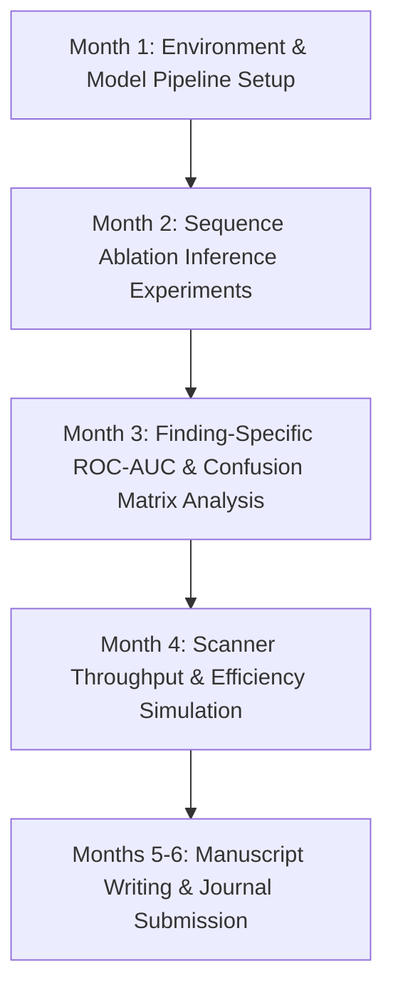

# MSc Project Plan — Student 2: Rapid Triage Protocol Optimization

**Project Title:** Sequence-Sparing Rapid Emergency Triage Protocol for Lumbar Spine MRI: An Ablation Study Using Deep Multi-Sequence Models  
**Academic Supervisor:** Dr. Polla Abdulhamid Fattah  
**Target Degree:** MSc in Computer Science / Artificial Intelligence / Biomedical Engineering  
**Duration:** 6 Months  

---

## 1. Executive Summary & Clinical Reframe

* **Clinical Bottleneck:** MRI scanner capacity at public teaching hospitals (like Rizgary Hospital) is severely constrained. Standard lumbar MRI protocols (Sagittal T1, Sagittal T2, Axial T2) take ~25 minutes per study, creating massive patient waiting lists.
* **The Project Reframe:** Rather than asking if single-sequence MRI can replace full diagnostic MRI, this study asks: **"Can a shortened sequence protocol (e.g., Sagittal T2 alone) serve as an accurate, rapid emergency triage tool to rule out critical central canal stenosis and severe nerve root compression in under 10 minutes?"**
* **Why it's ideal for MSc:** The student conducts controlled sequence ablation experiments without having to design a deep network from scratch.

> [!IMPORTANT]
> **Do not gate this project on AMOG-Net.** As originally written, this project could not
> begin until Selar's Phase 2 completed (around month 10), which would leave the MSc
> student idle for most of a year and make their graduation hostage to someone else's
> research risk.
>
> The clinical question — *which sequence carries the diagnostic information for which
> finding* — does not require AMOG-Net. A standard ResNet50 or EfficientNet baseline
> trained per sequence configuration answers it perfectly well, and a simpler model
> arguably makes the ablation **more** interpretable, since any accuracy drop is
> attributable to the missing sequence rather than to interactions inside a complex
> architecture.
>
> **Plan:** start with a simple baseline immediately. If AMOG-Net is ready in time, add
> it as a second arm and report both. That converts a hard dependency into an optional
> bonus.

---

## 2. Research Questions (RQs)

* **RQ1:** What is the diagnostic accuracy drop (AUC / F1 score) per finding type (central canal stenosis vs. neural foraminal stenosis vs. disc herniation) when sequence inputs are ablated from Full (T1+T2+Axial) to Single (T2 Sagittal alone)?
* **RQ2:** Which specific sequence is indispensable for which anatomical finding — for
  example, is Sagittal T1 mandatory for neural foraminal assessment, or can Sagittal T2
  suffice for screening? *(Subarticular assessment cannot be included: the local reports
  contain no subarticular findings at all, so there is no reference standard to test
  against on this cohort.)*
* **RQ3:** Can a rapid triage model achieve ≥92% sensitivity for urgent surgical findings (e.g., severe canal compromise / extrusion) while reducing scan acquisition time by over 50%?

---

## 3. Experimental Setup & Sequence Combinations

The student will test 4 sequence input configurations on the 294 multi-sequence Rizgary DICOM studies using Selar's pre-trained model:

| Configuration | Sequences Provided as Input | Simulated Scan Time | Intended Clinical Role |
| :--- | :--- | :---: | :--- |
| **Config A (Full)** | Sagittal T1 + Sagittal T2 + Axial T2 | ~25 Minutes | Standard Diagnostic Reference |
| **Config B (Sagittal Only)**| Sagittal T1 + Sagittal T2 | ~15 Minutes | Intermediate Rapid Protocol |
| **Config C (Rapid Triage)**| **Sagittal T2 Alone** | **~8–10 Minutes** | **Ultra-Fast Emergency Screening** |
| **Config D (T2 Combo)** | Sagittal T2 + Axial T2 | ~18 Minutes | Axial-Preserved Screening |

---

## 4. Methodological Workflow & Timeline

### Month 1: Model Setup & Baseline Verification
- Train a standard baseline (ResNet50 or EfficientNet-B4, ImageNet-initialised) on the
  full-protocol configuration. Use AMOG-Net weights instead **only if** they are
  available by this point; do not wait for them.
- Verify baseline inference on 294 Rizgary multi-sequence DICOM studies under Config A (Full Protocol).

### Month 2: Sequence Ablation Experiments
- Execute systematic sequence masking: zero-out or strip T1 Sagittal, Axial T2, or T2 Sagittal channels.
- Record predicted probabilities across all evaluable targets (canal stenosis at 5 levels; foraminal where laterality is stated) for all 4 configurations (294 cases × 4 configs = 1,176 evaluation runs).

### Month 3: Clinical Performance Evaluation
- Calculate ROC-AUC, Macro-F1, Sensitivity, and Specificity for each configuration broken down by finding category:
  1. Central Canal Stenosis.
  2. Neural Foraminal Stenosis.
  3. Disc Extrusion vs. Bulge.
- Perform Delong tests to evaluate statistical significance of AUC differences between Full and Rapid Triage protocols.

### Month 4: Hospital Throughput Simulation
- Model scanner throughput capacity at Rizgary Hospital under varying ratios of Rapid Triage vs. Full Diagnostic protocols.
- Calculate potential reduction in patient waiting list days.

### Months 5–6: Paper Writing & Thesis Submission
- Write manuscript emphasizing safety, sensitivity thresholds, and emergency triage utility.

---

## 5. Target Venues & Primary Deliverables

* **Targets** — Reach: *Radiology: Artificial Intelligence*. Target: *European Journal of Radiology* (IF ~3.3). Floor: *BMC Medical Imaging* or *Academic Radiology*.
* **Note:** the throughput argument is what makes this attractive to a radiology journal. Lead with scanner time and waiting lists, not with model architecture.
* **Primary Output:** 1 peer-reviewed journal paper **submitted** + MSc Thesis Dissertation.

---

## 6. Risk Management & Ethical Safeguards

| Potential Risk | Severity | Mitigation Strategy |
| :--- | :---: | :--- |
| Reviewers object to dropping T1 sequence (missing bone marrow lesions) | High | State explicitly throughout manuscript that this is a **Rapid Triage Screening Tool** for acute nerve compression, NOT a comprehensive diagnostic protocol. |
| Model performance drops severely on single-sequence input | Medium | Evaluate whether combining Sagittal T2 + Axial T2 (Config D) retains high accuracy while still saving scan time. |
