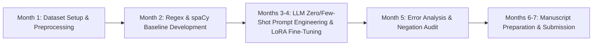

# MSc Project Plan — Student 3: Clinical Information Extraction NLP Benchmark

**Project Title:** Benchmarking Open-Weight LLMs vs. Rule-Based NLP for Information Extraction from Unstructured English Radiology Reports in Middle Eastern Teaching Hospitals  
**Academic Supervisor:** Dr. Polla Abdulhamid Fattah  
**Target Degree:** MSc in Computer Science / Artificial Intelligence / Data Science  
**Duration:** 6–8 Months  

---

## 1. Executive Summary & NLP Research Gap

* **Research Gap:** Free-text radiology reports written in non-English speaking regions (e.g., Kurdistan/Iraq) often use English narrative text but contain regional stylistic variations, non-standard hedging, ambiguous anatomical shorthand, and inconsistent formatting.
* **Project Objective:** Benchmark classical regex/rule-based NLP, spaCy pipelines, and modern open-weight Large Language Models (e.g., Llama-3, Qwen-2.5, BioMistral via Ollama/vLLM) on extracting a **level-resolved multi-label finding matrix** from 299 narrative radiology `.docx` reports.

> [!WARNING]
> **The target schema is NOT RSNA's 25 targets.** This was verified by scanning all 299
> reports. RSNA's schema is 5 conditions × 5 levels, but the local reports contain:
>
> | RSNA condition | Coverage in the 299 local reports |
> | :--- | :---: |
> | Spinal canal stenosis | **97%** |
> | Neural foraminal narrowing | **78%** |
> | Left / right subarticular stenosis | **0%** — checked under six spellings |
> | Laterality stated (left/right) | **27%** |
>
> Ten of RSNA's 25 targets therefore have **no local ground truth at all**, and another
> ten are only partially recoverable because most reports do not state a side.
>
> **Extract the schema the reports actually use** — disc bulge, protrusion, extrusion,
> dehydration, disc height, ventral theca indentation, nerve-root pressure, ligamentum
> flavum, facet arthrosis, osteophyte, canal stenosis — each resolved to level, and to
> side where stated. Map to RSNA's schema afterwards, for the subset where the two
> genuinely overlap.
>
> Quantifying what radiologists *do not* report is itself a publishable finding for this
> project and feeds the reporting-completeness study (Option 4).
* **Why it's ideal for MSc:** **Pure NLP / Health Informatics focus.** Does not require DICOM image processing or GPU-intensive vision training. Highly publishable in medical informatics venues.

---

## 2. Research Questions (RQs)

* **RQ1:** How do zero-shot and few-shot open-weight LLMs (Llama-3-8B, Qwen-2.5-7B) compare to deterministic regex rules in extracting multi-label spinal findings from unstructured Middle Eastern English reports?
* **RQ2:** What is the impact of structured prompting (e.g., JSON schema enforcement via Instructor/Outlines) on reducing LLM hallucinations in clinical narrative parsing?
* **RQ3:** What are the primary linguistic failure modes (e.g., negation handling, multi-level span resolution like *"L3-L5 bulges"*, or hedging like *"possible extrusion"*) across regex vs. LLM approaches?

---

## 3. Evaluated Architectures & Models

1. **Baseline 1 (Deterministic Regex & Heuristics):** Python rule-based pattern matcher.
2. **Baseline 2 (spaCy Clinical Named Entity Recognition):** Custom spaCy pipeline with NegEx rule integration.
3. **Model 1 (Zero-Shot Open LLM):** Llama-3-8B-Instruct via Ollama with JSON schema output.
4. **Model 2 (Domain-Specific LLM):** BioMistral-7B / Clinical-Llama.
5. **Model 3 (Few-Shot Fine-Tuned Local LLM):** Qwen-2.5-7B fine-tuned via LoRA on 100 annotated reports.

---

## 4. Methodological Workflow & Timeline

### Month 1: Data Preparation & Environment Setup
- Load 299 English `.docx` narrative reports from Rizgary Teaching Hospital.
- Clean text, strip header/footer boilerplates, and set up evaluation splits (100 train / 50 val / 149 test).
- Use the manually verified local Gold Standard matrix as ground truth (see the schema warning above -- not RSNA 25-target).

### Month 2: Classical NLP Baselines
- Build deterministic Regex parser with rule-based level-binding and negation detection.
- Train/configure spaCy pipeline for entity extraction.

### Months 3–4: LLM Benchmarking & LoRA Fine-Tuning
- Deploy Llama-3-8B, Qwen-2.5-7B, and BioMistral using Ollama and vLLM.
- Implement structured schema extraction using Pydantic / Instructor.
- Fine-tune Qwen-2.5-7B using LoRA on the 100-report training set.

### Month 5: Evaluation & Error Analysis
- Calculate Precision, Recall, Micro-F1, and Macro-F1 across all local target labels.
- Perform detailed linguistic failure analysis: quantify false positives due to implied negatives vs. multi-level ambiguity.

### Months 6–7: Paper Writing & Thesis Defense
- Draft manuscript highlighting localized NLP performance and open-weight model efficiency.

---

## 5. Target Venues & Primary Deliverables

* **Targets** — Reach: *IEEE JBHI*. Target: *Journal of Biomedical Informatics*. Floor: *BMC Medical Informatics and Decision Making*. Note that 299 reports is a small corpus by NLP standards; lead with the regional and linguistic novelty, not the scale.
* **Primary Output:** 1 peer-reviewed NLP journal paper **submitted** + MSc Thesis Dissertation + open-source parsing tool.

---

## 6. Risk Management

| Potential Risk | Severity | Mitigation Strategy |
| :--- | :---: | :--- |
| LLM API latency / local hardware constraint | Medium | Use quantized 4-bit (GGUF) models running locally on a single GPU (e.g. RTX 3090/4090). |
| JSON output formatting errors from LLMs | Low | Use constrained decoding libraries like `outlines` or `guidance` to strictly enforce schema output. |
