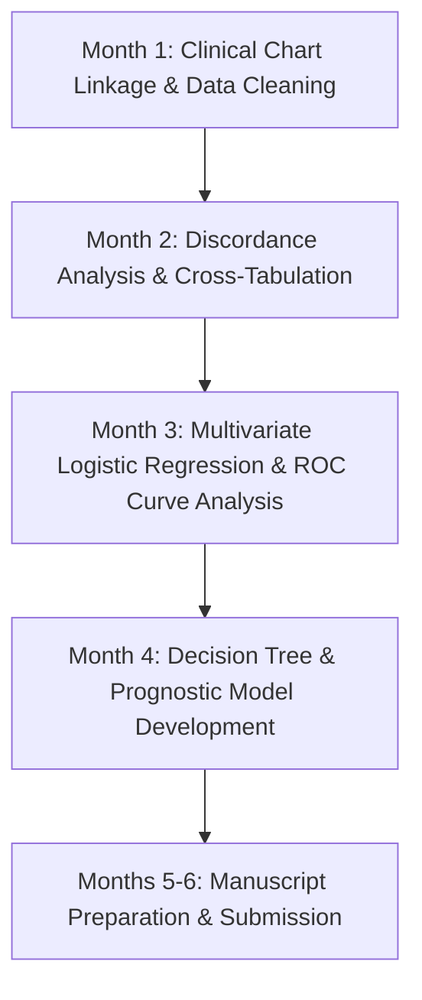

# MSc Project Plan — Student 4: Clinical Symptom & Surgical Prognostics

**Project Title:** Discordance Between Radiological Severity and Clinical Symptoms in Lumbar Degeneration: Prognostic Value of AI-Derived Stenosis Grading  
**Academic Supervisor:** Dr. Polla Abdulhamid Fattah  
**Target Degree:** MSc in Medical Informatics / Clinical Data Science / Spine Surgery Research  
**Duration:** 6 Months (Conditional Bonus Project)  

---

> [!CAUTION]
> **DO NOT ASSIGN A STUDENT TO THIS PROJECT YET.**
>
> Every research question below depends on clinical data that **has not been confirmed to
> exist**: presenting symptoms, examination findings, treatment decision, and outcome.
> None of it is present in the `Data/` folder as delivered — that contains imaging and
> radiology reports only.
>
> **Required before this becomes a project:** a written confirmation from Rizgary Hospital
> that symptom and outcome records exist, are retrievable for these specific 299 patients,
> and may be linked to the imaging under the existing agreement.
>
> If that confirmation arrives, this becomes the **highest-value study in the entire
> programme** — imaging-to-symptom discordance is the most-cited unresolved problem in the
> lumbar literature, and few groups can obtain the linkage. Treat it as a standing request
> to the hospital, not as a staffed project. Ask early: retrospective linkage gets harder
> once a data-collection window closes.

---

## 1. Executive Summary & Clinical Context

* **Clinical Dilemma:** Radiological stenosis on MRI correlates notoriously poorly with patient symptoms. Up to 30–40% of asymptomatic adults show anatomical disc herniation on MRI, while patients with severe radiculopathy may show modest imaging findings.
* **Project Objective:** Link AI-derived multi-level radiological stenosis severity scores to actual patient presenting symptoms (e.g., radiculopathy vs. neurogenic claudication vs. low back pain) and surgical vs. conservative treatment outcomes at Rizgary Teaching Hospital.
* **Important Note:** This is a **conditional high-ROI project** that depends on Rizgary Hospital providing supplementary clinical chart data alongside the DICOM scans.

---

## 2. Research Questions (RQs)

* **RQ1:** What is the degree of discordance between AI-graded anatomical stenosis severity ($L1\text{--}L2 \dots L5\text{--}S1$) and presenting clinical symptoms in a Middle Eastern cohort?
* **RQ2:** Which specific radiological finding combination (e.g., central canal vs. lateral recess vs. foraminal compromise) is the strongest multivariate predictor of surgical intervention?
* **RQ3:** Does an AI-derived aggregate Lumbar Degeneration Index (LDI) predict 1-year post-treatment symptom resolution better than traditional single-level grading?

---

## 3. Required Data & Clinical Variables

1. **Radiological Data:** Audited local finding matrix + Selar's AMOG-Net predicted severity probabilities for the 294 Rizgary cases.
2. **Clinical Chart Data (To be requested from Rizgary Hospital):**
   - Presenting Chief Complaint (Radiculopathy, Neurogenic Claudication, Axial Low Back Pain).
   - Duration of Symptoms (< 3 months, 3–12 months, > 12 months).
   - Treatment Path (Conservative / Physical Therapy vs. Surgical Decompression / Microdiscectomy).
   - Post-Treatment Outcome (Symptom Resolution, Partial Improvement, Unchanged).

---

## 4. Methodological Workflow & Timeline

### Month 1: Hospital Data Linkage & Anonymization
- Retrieve retrospective outpatient/surgical logs from Rizgary Teaching Hospital matching the 294 PACS case IDs.
- Link clinical symptom fields with radiological target variables.

### Month 2: Symptom-Radiology Discordance Quantification
- Calculate Cohen's Kappa ($\kappa$) and Goodman-Kruskal gamma between radiological stenosis grade and clinical severity.
- Identify "radiologically severe but clinically mild" and "radiologically mild but clinically severe" discordance rates.

### Month 3: Predictive Modeling of Surgical Intervention
- Build multivariable logistic regression models to predict surgical conversion based on radiological findings + patient age/sex.
- Calculate Odds Ratios (OR) and Area Under the ROC Curve (AUC).

### Month 4: Prognostic AI Index Validation
- Test whether AI multi-level graph embeddings improve surgical outcome prediction compared to single-level maximum stenosis grades.

### Months 5–6: Paper Writing & Submission
- Draft manuscript targeting top spine clinical journals.

---

## 5. Target Venues & Deliverables

* **Targets** — Reach: *The Spine Journal* (IF ~3.8) or *Spine*. Target: *European Spine Journal*. Floor: *BMC Musculoskeletal Disorders*.
* **Note:** if the clinical linkage is obtained, this is the most clinically significant paper in the programme and justifies aiming high.
* **Primary Output:** 1 clinical prognosis paper **submitted** + MSc Thesis Dissertation.

---

## 6. Risk Management & Fallback Options

| Potential Risk | Severity | Mitigation Strategy |
| :--- | :---: | :--- |
| Rizgary Hospital cannot provide retrospective clinical symptom logs | **High** | **Fallback:** Reframe study as a synthetic simulation / radiologist reader concordant study using blinded clinical reader ratings. |
| Incomplete follow-up outcome data | Medium | Focus analysis on initial presenting symptoms vs. imaging findings rather than long-term outcome tracking. |
