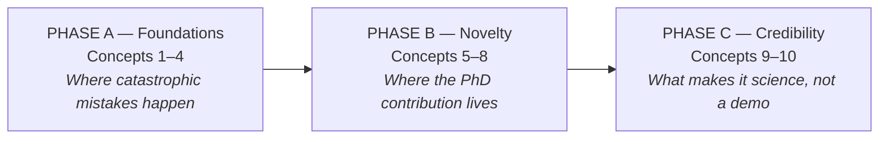
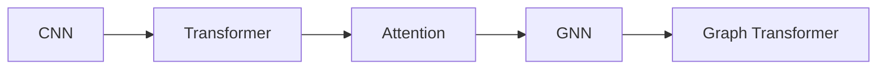

# Training Curriculum — Selar

**Ten concepts required to build and defend the revised AMOG-Net v2 research programme**
Supervisor: Dr. Polla Abdulhamid Fattah · Candidate: Selar · Companion to [`01_SELAR_PHD_ROADMAP.md`](01_SELAR_PHD_ROADMAP.md) and [`07_AMOGNET_TECHNICAL_SPEC.md`](07_AMOGNET_TECHNICAL_SPEC.md)

---

## How to use this document

You do **not** need to become a radiologist, nor to be able to re-derive a graph
transformer from scratch. The bar is different, and it is this:

> For every concept, you must understand it well enough to **defend why it is in the
> methodology**, and to **diagnose it when it fails**.

That second half is what a viva actually tests. Anyone can report that a model scored
0.91. You will be asked why the L5–S1 predictions are worse than L4–L5, and the answer
will come from understanding anatomy, geometry and class imbalance — not from the model.

**Each concept below follows the same five-part structure**, so you can work through them
consistently:

| Part | What it gives you |
| :--- | :--- |
| **What it is** | The one-paragraph version |
| **Why this thesis needs it** | The specific role it plays in AMOG-Net — not a generic justification |
| **You must be able to** | Concrete, checkable capabilities |
| **Self-check** | A question you should be able to answer out loud. If you cannot, you are not done |
| **Weight & time** | How much it matters, and a realistic estimate |

Tick each box as you go. Estimates assume study alongside other work, not full-time.

---

## The three phases

The ten concepts are not a flat list. They group into three phases that do different jobs:



**Phase A is not the boring part.** Almost every catastrophic failure in medical imaging
AI happens *before* the sophisticated model: wrong labels, broken anatomical
correspondence, data leakage, mishandled DICOM geometry, inappropriate evaluation. A
flawless graph transformer trained on misaligned labels produces a confident, worthless
result. Do not rush Phase A.

**Phase B is where the novelty is.** Concepts 5–7 contain the three central methodological contributions: disease-adaptive sequence routing, anatomically aligned cross-sequence self-supervision, and typed heterogeneous graph reasoning. Concept 8 remains essential supporting methodology, but ordinal learning is no longer claimed as standalone novelty because closely related lumbar ordinal-grading work now exists.

**Phase C is what makes it a PhD.** Excellent code with weak experimental design is an
engineering project. Concepts 9–10 are the difference.

---

## Study order — read this before planning your reading

There are **three different ways to order this material, and they disagree**:

| Ordering | Answers |
| :--- | :--- |
| **Research importance** | What matters most to this thesis |
| **Learning difficulty** | What is easiest to pick up |
| **Prerequisite order** | What must be understood before what |

The numbering below follows **research importance, with ease breaking ties**. That is the
right order for deciding *how much depth* each topic needs. It is the **wrong order for
deciding what to read first.**

The clearest example: graph transformers (concept 7) rank at the very top by importance,
because the anatomical graph is the central methodological claim. But you cannot usefully
read a graph transformer paper before understanding attention, and attention is hard
without convolutional intuition first:



**Practical rule: study in dependency order, allocate depth by importance.**

---

# PHASE A — Foundations

*Concepts 1–4. Do not proceed to Phase B until these are solid.*

## 1. Lumbar MRI anatomy, pathology, and the label structure

**What it is.** What the data actually means, before any model touches it: L1–L2 through
L5–S1, spinal canal stenosis, left/right neural foraminal narrowing, left/right
subarticular stenosis, and the Normal/Mild → Moderate → Severe grading.

**Why this thesis needs it.** LumbarDISC carries five anatomical targets at each of five
levels — which is precisely why the system becomes a **25-target structured prediction
problem** rather than image classification. If you do not understand the label structure,
you will build the wrong model. This is also where the local Rizgary cohort diverges: its
reports contain canal stenosis and foraminal narrowing, but **no subarticular findings at
all**, so ten of the 25 targets have no local ground truth.

**You must be able to:**
- [ ] Point to a disc, the canal, a neural foramen and a subarticular recess on both a sagittal and an axial image
- [ ] Explain what T1, T2 and STIR each make visible, and why
- [ ] Trace one row of an RSNA annotation to the exact image region it refers to
- [ ] State which sequence is the correct evidence for each of the five conditions

**Self-check.** *"A patient has moderate left foraminal narrowing at L4–L5. Which image,
which slice, and what am I looking at to see it?"*

**Weight: 10/10 · Estimated 3–4 weeks.** The foundation of the entire PhD.

---

## 2. DICOM, medical-image geometry, and preprocessing

**What it is.** Considerably more than converting DICOM to PNG. The patient coordinate
system, and how to move between images within it.

**Why this thesis needs it.** This is what lets you state that *this* location on a
sagittal T2 corresponds to *those* axial slices. Without it, multi-sequence fusion is
guesswork. AMOG-Net's Stage A depends entirely on preserving this geometry — and the
single most common way to silently destroy a medical imaging project is to discard the
3D coordinate system during preprocessing.

**You must be able to:**
- [ ] Use `ImagePositionPatient`, `ImageOrientationPatient`, `PixelSpacing`, `SliceThickness`
- [ ] Reconstruct a volume from a series and resample it correctly
- [ ] Map a point in one series to the corresponding location in another
- [ ] Apply intensity normalisation and explain why it matters across scanners
- [ ] Work confidently in **PyDICOM**, **SimpleITK** and **MONAI**

**Self-check.** *"Given a sagittal coordinate at L4–L5, which axial slices cover it, and
how did I compute that?"*

**Weight: 10/10 · Estimated 3–4 weeks.**

---

## 3. Segmentation, detection, localisation and ROI extraction

**What it is.** Three distinct tasks that are easy to confuse:

| Task | Question answered |
| :--- | :--- |
| **Classification** | *What* disease, and how severe? |
| **Detection / localisation** | *Where* is it? |
| **Segmentation** | *Exactly which pixels* belong to the structure? |

**Why this thesis needs it.** For AMOG-Net, localisation is an *enabling technology*, not
the contribution: find L1–L2 … L5–S1 automatically, then extract standardised
disease-specific ROIs. The literature is consistent that localising before classifying
improves grading — and equally consistent that detection transfers across hospitals while
grading does not, which is exactly what the domain-transfer study exploits.

**You must be able to:**
- [ ] Explain U-Net, U-Net++ and nnU-Net, and when each is appropriate
- [ ] Implement heatmap regression for landmark localisation
- [ ] Use Dice loss and focal loss, and say when each is the right choice
- [ ] Report Dice, IoU, and localisation error in millimetres — and interpret them

**Self-check.** *"My Dice is 0.91 but the L5–S1 disc is sometimes missed entirely. What
does that tell me, and which metric would have revealed it sooner?"*

**Weight: 9.5/10 · Estimated 4–5 weeks.**

---

## 4. 2D, 2.5D and 3D deep learning for MRI

**What it is.** How much spatial context to give the network, and what each choice costs.

**Why this thesis needs it.** Treating each slice as an independent photograph discards
the fact that a disc spans several slices and that radiologists integrate across them.
AMOG-Net uses **2.5D** — a stack of adjacent slices around each target — because it
captures through-plane context at roughly 2D cost. You need to understand why that
compromise is the right one here.

**You must be able to:**
- [ ] Explain receptive fields, spatial context and anisotropic voxels
- [ ] Build a 2.5D ROI: slices `[i-2, i-1, i, i+1, i+2]` around a target disc level
- [ ] Compare memory and compute for 2D vs 2.5D vs full 3D
- [ ] Describe ResNet, ConvNeXt, EfficientNet and Swin Transformer as feature encoders

> [!NOTE]
> Learn these architectures as **encoders you will use**, not as a comparison you will
> publish. Vision transformers are thoroughly established in medical imaging — using one
> is not, by itself, novelty.

**Self-check.** *"Why 2.5D and not 3D? Give the memory argument and the accuracy argument."*

**Weight: 9/10 · Estimated 3 weeks.**

---

# PHASE B — Where the novelty lives

> [!IMPORTANT]
> **Closest-work update (2026).** Chai et al. already combine anatomy-guided segmentation,
> multi-sequence level-specific ROIs, quantitative biomarkers, inter-level Transformer
> context and ordinal grading. Therefore the candidate must be able to explain why the PhD
> is *not* simply that pipeline with another backbone. The defensible distinction is:
> **typed 25-target disease–anatomy graph + disease-conditioned missing-modality routing +
> anatomically aligned cross-sequence SSL + independent external transfer.**
>
> Required reading before claiming novelty: Chai Z et al. (2026), Frontiers in Medicine,
> doi:10.3389/fmed.2026.1848548.


*Concepts 5–7 contain the core novelty. Concept 8 is essential supporting methodology and may contribute to a broader paper, but should not be forced into a standalone publication.*

## 5. Multi-view and multi-sequence fusion

**What it is.** How to combine Sagittal T1 + Sagittal T2/STIR + Axial T2 into one decision.

**Why this thesis needs it.** This is one of AMOG-Net v2's three central novelty areas: disease-conditioned adaptive sequence routing with missing-modality robustness. The interesting
question is *not* "which sequence is best?" — it is whether the model can learn a
**disease-specific** weighting, so that foraminal narrowing leans on sagittal T1 while
canal stenosis leans on axial T2:

```
F_c = Σ_m  g_(c,m) · F_m        where  Σ_m g_(c,m) = 1
```

with `g` a learned confidence per sequence `m` and condition `c`. Modality dropout during
training then makes the system robust when a sequence is missing — which matters, because
real examinations do not always deliver all three.

**You must be able to:**
- [ ] Distinguish early, intermediate/feature, and late/decision fusion
- [ ] Implement cross-attention between two feature streams
- [ ] Explain gating networks and mixture-of-experts
- [ ] Implement modality dropout and explain what it buys

**Self-check.** *"One patient has no axial T2. What does my model do, and why does it not simply crash?"*

**Weight: 9.5/10 · Estimated 4 weeks.**

---

## 6. Self-supervised and contrastive representation learning

**What it is.** Learning useful representations from unlabelled data, before any
supervised training.

**Why this thesis needs it.** This is one of the three central novelty areas. Generic contrastive
learning treats augmented copies of an image as positive pairs. The proposal here is
**anatomically defined** pairs instead:

> Same patient · same spinal level · **different MRI sequence** → these should have
> related representations, despite looking completely different.

That is *cross-sequence anatomical contrastive learning*, and it uses DICOM spatial
correspondence rather than generic image similarity. It also directly attacks your
data-size problem: this cohort is small, and self-supervision is how you get more from it.

**You must be able to:**
- [ ] Explain SimCLR, MoCo, BYOL and DINO teacher–student learning
- [ ] Define positive and negative pairs, embeddings, cosine similarity, temperature
- [ ] Write the InfoNCE loss and explain each term
- [ ] **Design and justify your own pairing strategy** — this is the contribution

**Self-check.** *"Why is same-level-different-sequence a better positive pair than a rotated copy of the same image?"*

**Weight: 9/10 · Estimated 4–5 weeks.** Potential standalone paper.

---

## 7. Graph neural networks and graph transformers

**What it is.** Learning over data with explicit relational structure rather than a grid.

**Why this thesis needs it.** This is a central novelty area of AMOG-Net v2, but it must be distinguished from recent inter-level Transformer work and prior CNN–GNN disc grading. The spine is not
25 independent predictions — levels are biomechanically coupled, conditions at one level
interact, and left and right are anatomically symmetric. Represent each
level-condition pair as a node:

```
v(L4-L5, Canal)      v(L4-L5, LeftForamen)      v(L4-L5, RightForamen)  …
```

with three distinct edge types:

| Edge type | Connects |
| :--- | :--- |
| **Longitudinal** | Adjacent levels — L3–L4 ↔ L4–L5 |
| **Disease interaction** | Conditions at the same level — canal ↔ foraminal ↔ subarticular |
| **Bilateral** | Left ↔ right at the same level |

The literature is explicit that graph construction should be **anatomically justified**
rather than arbitrary — which is exactly the argument the spine lets you make.

**You must be able to:**
- [ ] Read graph notation `G = (V, E)`, adjacency matrices, node and edge features
- [ ] Explain message passing, and implement GCN, GraphSAGE and GAT
- [ ] Explain heterogeneous graphs and relation-aware attention
- [ ] Justify every edge in your graph on anatomical grounds

**Self-check.** *"Why should an L3–L4 finding inform the L4–L5 prediction? Answer clinically, not mathematically."*

**Weight: 10/10 · Estimated 6–8 weeks.** The hardest concept here — budget accordingly.

---

## 8. Ordinal classification, class imbalance and cost-sensitive learning

**What it is.** Treating severity as **ordered** rather than as three unrelated categories:

```
Normal/Mild  <  Moderate  <  Severe
```

**Why this thesis needs it.** Standard cross-entropy penalises *severe graded as normal*
exactly as heavily as *moderate graded as severe*. Clinically these are not remotely
equivalent. You need a **cost matrix** that makes the dangerous error expensive:

| True ↓ / Predicted → | Normal | Moderate | Severe |
| :--- | :---: | :---: | :---: |
| **Normal** | 0 | 1 | 2 |
| **Moderate** | 1 | 0 | 1 |
| **Severe** | **4** | 1 | 0 |

LumbarDISC is severely imbalanced — 85.4% of spinal canal grades are Normal/Mild, 5.9%
Severe. A model that always predicts Normal/Mild scores 85% accuracy and is clinically
useless.

> [!IMPORTANT]
> **An open question, not a solved one.** Niemeyer et al. tested soft-kappa loss, ordinal
> cross-entropy and regression losses against plain cross-entropy on 7,948 discs — and
> found **none improved on it**. Do not assume ordinal losses will help. Test it, and
> report the result either way. A negative result here is publishable.

**You must be able to:**
- [ ] Explain ordinal regression and cumulative-link models; implement CORAL/CORN
- [ ] Apply weighted cross-entropy, focal loss, oversampling, class-balanced losses
- [ ] Formulate and justify a clinical cost matrix
- [ ] Explain why **macro F1, balanced accuracy, per-class recall and quadratic weighted kappa** beat raw accuracy here

**Self-check.** *"My accuracy is 86%. Why might that be worse than a model scoring 79%?"*

**Weight: 9/10 · Estimated 3–4 weeks.**

---

# PHASE C — What makes it science

*Concepts 9–10. Skip these and you have an engineering demo, not a doctorate.*

## 9. Calibration, uncertainty and explainability

**What it is.** The difference between these two outputs:

> *"Severe — and I am confident."*  vs  *"Severe — but I am uncertain."*

**Why this thesis needs it.** For clinical triage this distinction is the whole point: an
uncertain case can be referred to a radiologist rather than silently graded. It also
connects to the graph — a severe prediction consistent with neighbouring levels should
carry less uncertainty than an isolated one contradicted by its surroundings.

**You must be able to:**
- [ ] Distinguish aleatoric from epistemic uncertainty
- [ ] Implement deep ensembles and Monte Carlo dropout
- [ ] Apply temperature scaling; compute Expected Calibration Error and Brier score
- [ ] Understand conformal prediction and selective prediction
- [ ] Use Grad-CAM and attention maps — **and state their limits**

> [!WARNING]
> An attention map shows *where* the network responded, not *why*. It is a sanity check,
> not evidence of reasoning. Presenting saliency as proof of causal understanding is a
> common and correctly criticised overclaim.

**Self-check.** *"My model says Severe with probability 0.71. Should a clinician trust that number? What would make it trustworthy?"*

**Weight: 8.5/10 · Estimated 3 weeks.**

---

## 10. Experimental design, ablation, statistics and generalisation

**What it is.** The methodology that turns results into evidence.

**Why this thesis needs it.** This concept, more than any other, decides whether good
code becomes a good thesis. It is not enough to report:

> AMOG-Net = 0.91

You must show what each component actually contributes:

```
Baseline → +ROI → +MultiView → +Ordinal → +SSL → +Graph → +Uncertainty
```

with confidence intervals at every step. If the graph adds 0.004 and the ROI cropping
adds 0.09, that is a finding — and an honest one.

RSNA makes this realistic rather than hypothetical: its studies come from **eight
institutions across six countries**, so site-aware evaluation and domain-generalisation
experiments are genuinely possible. *(Note: the published LumbarDISC cohort is 2,697
patients; the public Kaggle release held locally is 1,975 studies.)*

**You must be able to:**
- [ ] Split at **patient level and site level** — never at image level
- [ ] Run nested validation, repeated seeds, bootstrap confidence intervals
- [ ] Compare models statistically (DeLong tests, paired tests) rather than by eye
- [ ] Design and interpret an ablation study
- [ ] Identify data leakage, domain shift, and scanner/vendor effects

**Self-check.** *"The same patient appears in train and test. What breaks, and how would I have caught it?"*

**Weight: 10/10 · Estimated 3–4 weeks.**

---

# Progress tracker

| # | Concept | Phase | Weight | Est. | Done |
| :-: | :--- | :---: | :---: | :---: | :---: |
| 1 | Lumbar MRI anatomy & label structure | A | 10 | 3–4 w | [ ] |
| 2 | DICOM geometry & preprocessing | A | 10 | 3–4 w | [ ] |
| 3 | Segmentation, detection, ROI extraction | A | 9.5 | 4–5 w | [ ] |
| 4 | 2D / 2.5D / 3D modelling | A | 9 | 3 w | [ ] |
| 5 | Multi-view & multi-sequence fusion | B | 9.5 | 4 w | [ ] |
| 6 | Self-supervised & contrastive learning | B | 9 | 4–5 w | [ ] |
| 7 | Graph neural networks & transformers | B | 10 | 6–8 w | [ ] |
| 8 | Ordinal classification & cost-sensitive learning | B | 10 | 3–4 w | [ ] |
| 9 | Calibration, uncertainty, explainability | C | 8.5 | 3 w | [ ] |
| 10 | Experimental design & generalisation | C | 10 | 3–4 w | [ ] |

**Total: roughly 9–11 months of part-time study**, or 4–5 months if this is the primary
activity. Phase A alone is 13–16 weeks — plan for that rather than being surprised by it.

---

# The one-sentence version

The ten concepts form a single chain:

> **MRI anatomy → DICOM geometry → localisation → 2.5D representation → multi-sequence
> disease-adaptive fusion → anatomical self-supervision → typed heterogeneous graph reasoning → ordinal/calibrated grading →
> uncertainty → rigorous external validation.**

And the supervisory advice, stated plainly:

- **Do not start with graph transformers.** Start with 1–4. Most catastrophic mistakes in
  medical imaging AI happen before the sophisticated model ever runs.
- **5–8 is where the PhD novelty can be created.**
- **9–10 is what makes the work scientifically credible rather than merely technically impressive.**

---

# Reading list

| # | Topic | Source |
| :-: | :--- | :--- |
| 1 | LumbarDISC dataset & label structure | [Radiology: AI](https://pubs.rsna.org/doi/10.1148/ryai.250480) |
| 2 | Medical image transforms | [MONAI documentation](https://docs.monai.io/en/latest/transforms_idx.html) |
| 3 | Vision transformers in medical imaging | [PMC12701147](https://pmc.ncbi.nlm.nih.gov/articles/PMC12701147/) |
| 4 | Multimodal graph fusion in healthcare | [PMC12827511](https://pmc.ncbi.nlm.nih.gov/articles/PMC12827511/) |
| 5 | GNNs for medical imaging | [PMC13295888](https://pmc.ncbi.nlm.nih.gov/articles/PMC13295888/) |
| 6 | Uncertainty-aware deep learning in healthcare | [PMC9802673](https://pmc.ncbi.nlm.nih.gov/articles/PMC9802673/) |
| 7 | Explainable AI in medical imaging | [PMC12809972](https://pmc.ncbi.nlm.nih.gov/articles/12809972/) |

For the lumbar-specific literature — SpineNet, M-SCAN, SPIDER, the external-validation
studies — work from the 108-record bibliography in
`../lumbar_spine_mri_ai_literature_inventory.bib`, where every entry carries a summary of
what the paper actually found. Chapter 2 of the thesis
(`../thesis/chapter2.tex`) is organised along much the same structure as this curriculum.
